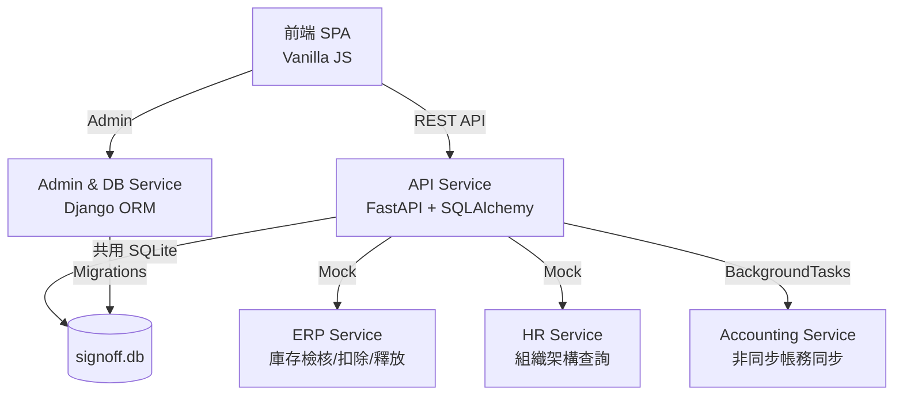

# 三廠區物流暨物料簽核系統 (SignOff System)

這是一套為跨廠區運作設計的**電子簽核工作流系統**，主要處理「物料清單 (BOM) 建立/變更」與「廠內/跨廠物料轉移」的簽核業務。系統具備微服務架構，利用 Django 管理基礎資料與 Schema，並由 FastAPI 提供高效能的非同步 REST API，前端則是原生的 Vanilla JS SPA。

---

## ✨ 核心特色 (Key Features)

* **動態簽核引擎 (WorkflowBuilder)**：自動依據「所屬廠區」、「物料風險」、「成本影響」以及「跨廠與否」動態產生簽核路徑 (如：生產主管 → 廠區主管 → 台北財務)。
* **微服務解耦架構**：
  * **Django (`admin_service`)**：負責資料庫 Schema (SQLite) 定義與後台介面管理。
  * **FastAPI (`api_service`)**：負責高效能 API 處理、狀態機轉換與外部系統 Mock 通訊。
* **ERP 庫存生命週期管理**：提交時預占庫存 (Reserve)、核准時正式扣除 (Deduct)、撤回時釋放庫存 (Release)，杜絕死庫問題。
* **非同步會計同步**：利用 FastAPI `BackgroundTasks` 在 API 回應後非同步執行，確保簽核操作秒回不卡頓。
* **併發安全**：支援**樂觀鎖 (Optimistic Locking)** 防止多人重複簽核，並具有庫存不足時的**自動駁回 (Auto-Reject)** 機制。

---

## 🗂️ 系統文件索引 (Documentation)

| 文件 | 說明 |
| :--- | :--- |
| [SA.md](docs/SA.md) | 系統分析規格書：廠區定義、簽核路徑矩陣、狀態機、例外處理 |
| [SD.md](docs/SD.md) | 系統設計規格書：微服務架構圖、資料表 Schema、ORM 映射 |
| [DEV.md](docs/DEV.md) | 開發者指南：環境建置、啟動指令、資料庫異動流程 |
| [SIT.md](docs/SIT.md) | 系統整合測試：各情境測試案例與驗收標準 |
| [UAT.md](docs/UAT.md) | 使用者驗收測試：驗收清單與測試帳號 |
| [USER_MANUAL.md](docs/USER_MANUAL.md) | 使用者操作手冊：各角色操作步驟與 FAQ |
| [UI_UX.md](docs/UI_UX.md) | UI/UX 設計規格：色彩系統、元件規範、RWD 斷點 |
| [MINDMAP.md](docs/MINDMAP.md) | 功能心智圖：全功能圖、簽核狀態機、決策樹 |

---

## 🏗️ 系統架構圖 (Architecture)



---

## 📂 目錄結構 (Project Structure)

```text
SignOffSystem/
├── admin_service/       # Django 微服務 (DB Migrations & Admin)
│   └── core/            # 資料模型 (models.py) 與 Admin 設定
├── api_service/         # FastAPI 微服務 (核心 API)
│   └── signoff_system/  # api.py / services.py / domain.py / models.py
├── docs/                # 系統文件 (SA, SD, SIT, UAT, DEV, UI_UX, MINDMAP)
├── frontend/            # 前端 SPA (index.html / style.css / app.js)
├── tests/               # 測試腳本
│   ├── test_workflow.py # 單元測試：核心簽核業務邏輯
│   ├── test_api.py      # 整合測試：FastAPI 端點 (TDD)
│   └── test_django_models.py  # Django ORM 模型測試
├── pytest.ini           # Pytest 設定 (pythonpath 整合)
├── requirements.txt     # Python 依賴清單
└── signoff.db           # 共用 SQLite 資料庫
```

---

## 🚀 快速啟動 (Quick Start)

### 1. 安裝相依套件
```bash
pip install -r requirements.txt
```

### 2. 啟動 Django Admin (資料與管理層)
```bash
cd admin_service
python manage.py runserver 8080
```
*後台管理介面：`http://127.0.0.1:8080/admin`*

### 3. 啟動 FastAPI (核心 API 層)
```bash
# 於專案根目錄執行
uvicorn signoff_system.api:app --reload --app-dir api_service
```
*API 文件 (Swagger)：`http://127.0.0.1:8000/docs`*

### 4. 開啟前端介面
直接以瀏覽器開啟 `frontend/index.html` 即可使用完整系統。

---

## 🧪 測試策略 (Testing)

本專案實踐測試驅動開發 (TDD)，涵蓋三個層次：

| 測試類型 | 檔案 | 說明 |
| :--- | :--- | :--- |
| **單元測試** | `tests/test_workflow.py` | 核心簽核引擎、狀態機、業務規則 |
| **整合測試** | `tests/test_api.py` | FastAPI 端點 E2E 測試 (TestClient) |
| **Django 模型測試** | `tests/test_django_models.py` | ORM Schema 驗證 |

執行所有測試：
```bash
pytest -v
```
