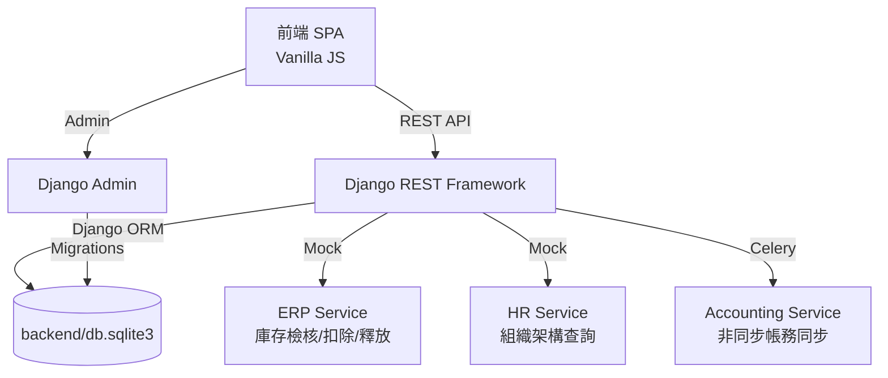

# 三廠區物流暨物料簽核系統 (SignOff System)

這是一套為跨廠區運作設計的**電子簽核工作流系統**，主要處理「物料清單 (BOM) 建立/變更」與「廠內/跨廠物料轉移」的簽核業務。系統以 Django + Django REST Framework 提供後端 API 與管理介面，搭配 Celery 處理外部同步與 SLA 背景任務，前端則是原生的 Vanilla JS SPA。

---

## ✨ 核心特色 (Key Features)

* **動態簽核引擎 (WorkflowBuilder)**：自動依據「所屬廠區」、「物料風險」、「成本影響」以及「跨廠與否」動態產生簽核路徑 (如：生產主管 → 廠區主管 → 台北財務)。
* **Django/DRF 後端架構**：
  * **Django (`backend`)**：負責資料庫 Schema、Django Admin、JWT 認證與系統設定。
  * **Django REST Framework (`backend/signoff`)**：負責 REST API、狀態機轉換與外部系統 Mock 通訊。
* **ERP 庫存生命週期管理**：提交時預占庫存 (Reserve)、核准時正式扣除 (Deduct)、撤回時釋放庫存 (Release)，杜絕死庫問題。
* **非同步會計同步**：利用 Celery 在 API 回應後非同步執行，確保簽核操作不被外部系統阻塞。
* **併發安全**：支援**樂觀鎖 (Optimistic Locking)** 防止多人重複簽核，並具有庫存不足時的**自動駁回 (Auto-Reject)** 機制。

---

## 🗂️ 系統文件索引 (Documentation)

| 文件 | 說明 |
| :--- | :--- |
| [SA.md](docs/SA.md) | 系統分析規格書：廠區定義、簽核路徑矩陣、狀態機、例外處理 |
| [SD.md](docs/SD.md) | 系統設計規格書：微服務架構圖、資料表 Schema、ORM 映射 |
| [DEV.md](docs/DEV.md) | 開發者指南：環境建置、啟動指令、資料庫異動流程 |
| [SIT.md](docs/SIT.md) | 系統整合測試：各情境測試案例與驗收標準 |
| [UAT.md](docs/UAT.md) | 使用者驗收測試：驗收清單與測試帳號 |
| [USER_MANUAL.md](docs/USER_MANUAL.md) | 使用者操作手冊：各角色操作步驟與 FAQ |
| [UI_UX.md](docs/UI_UX.md) | UI/UX 設計規格：色彩系統、元件規範、RWD 斷點 |
| [MINDMAP.md](docs/MINDMAP.md) | 功能心智圖：全功能圖、簽核狀態機、決策樹 |

---

## 🏗️ 系統架構圖 (Architecture)



---

## 📂 目錄結構 (Project Structure)

```text
SignOffSystem/
├── backend/             # Django + DRF 後端
│   ├── config/          # Django settings / urls / celery
│   └── signoff/         # models / serializers / views / services / tasks
├── docs/                # 系統文件 (SA, SD, SIT, UAT, DEV, UI_UX, MINDMAP)
├── frontend/            # 前端 SPA (index.html / style.css / app.js)
├── backend/tests/       # 服務層測試：簽核流程、狀態機、代理人、樂觀鎖
├── pytest.ini           # Pytest 設定 (pythonpath 整合)
├── requirements.txt     # Python 依賴清單
└── backend/db.sqlite3   # 開發用 SQLite 資料庫
```

---

## 🚀 快速啟動 (Quick Start)

### 1. 安裝相依套件
```bash
pip install -r requirements.txt
```

### 2. 啟動 Django Admin (資料與管理層)
```bash
cd backend
python manage.py runserver 8000
```
*後台管理介面：`http://127.0.0.1:8000/admin`*

### 3. 啟動 Celery Worker (外部同步與 SLA 背景任務)
```bash
cd backend
celery -A config worker --loglevel=info
```
*API 文件 (Swagger)：`http://127.0.0.1:8000/swagger/`*

### 4. 開啟前端介面
直接以瀏覽器開啟 `frontend/index.html`，或使用 `docker compose up --build` 透過 Nginx 開啟。

---

## 🧪 測試策略 (Testing)

本專案實踐測試驅動開發 (TDD)，涵蓋三個層次：

| 測試類型 | 檔案 | 說明 |
| :--- | :--- | :--- |
| **服務層測試** | `backend/tests/test_services.py` | 核心簽核引擎、狀態機、代理人、樂觀鎖 |
| **Django 系統檢查** | `python backend/manage.py check` | Django 設定與模型檢查 |

執行所有測試：
```bash
pytest -v
```
