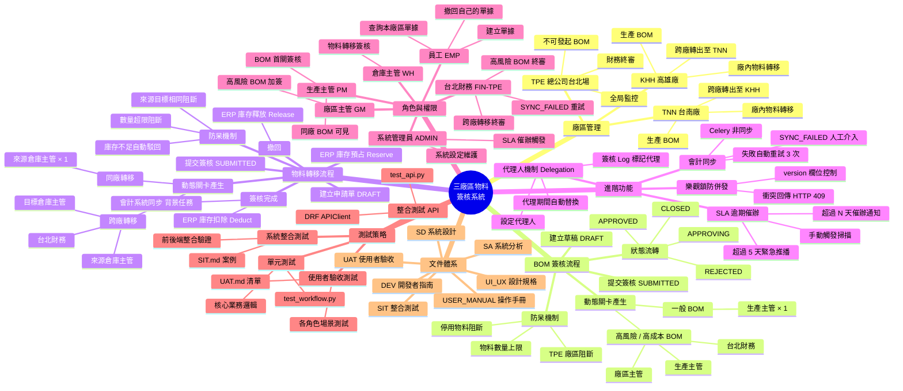
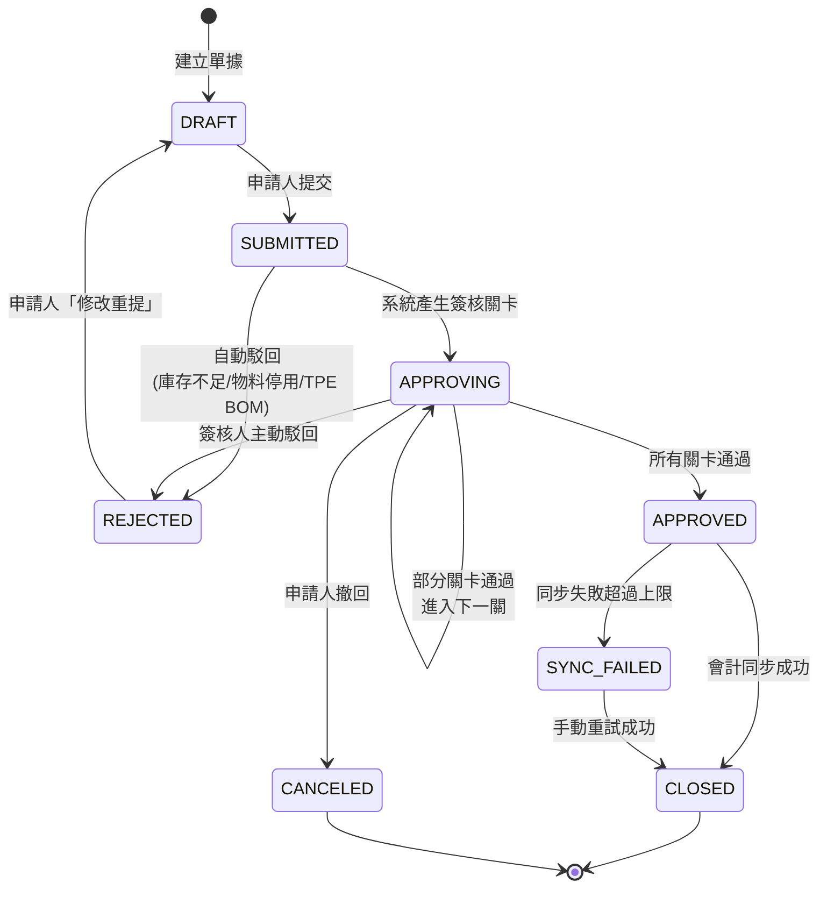
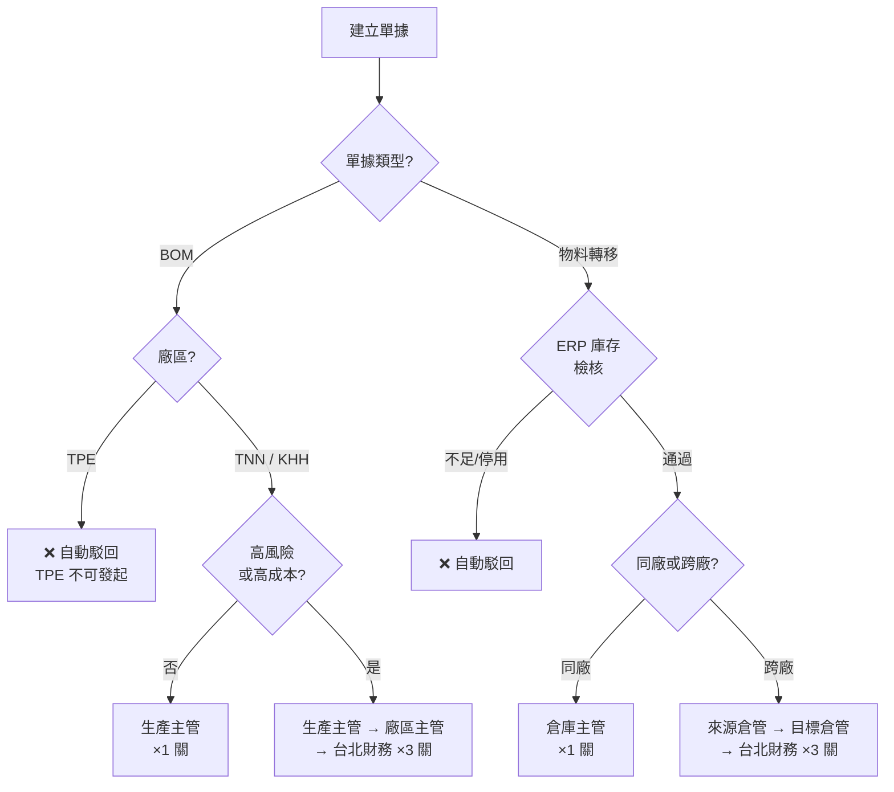

# 功能心智圖 (Feature Mind Map)

本文件以 Mermaid 心智圖呈現系統所有功能模組的關聯與層級，供需求討論、功能盤點與新人 Onboarding 使用。

---

## 1. 全功能心智圖

```mermaid
mindmap
  root((三廠區物料<br/>簽核系統))
    廠區管理
      TNN 台南廠
        生產 BOM
        廠內物料轉移
        跨廠轉出至 KHH
      KHH 高雄廠
        生產 BOM
        廠內物料轉移
        跨廠轉出至 TNN
      TPE 總公司台北場
        財務終審
        全局監控
        不可發起 BOM
    BOM 簽核流程
      建立草稿 DRAFT
      提交簽核 SUBMITTED
      動態關卡產生
        一般 BOM
          生產主管 × 1
        高風險 / 高成本 BOM
          生產主管
          廠區主管
          台北財務
      狀態流轉
        APPROVING
        APPROVED
        CLOSED
        REJECTED
      防呆機制
        TPE 廠區阻斷
        停用物料阻斷
        物料數量上限
    物料轉移流程
      建立申請單 DRAFT
      ERP 庫存預占 Reserve
      提交簽核 SUBMITTED
      動態關卡產生
        同廠轉移
          來源倉庫主管 × 1
        跨廠轉移
          來源倉庫主管
          目標倉庫主管
          台北財務
      簽核完成
        ERP 庫存扣除 Deduct
        會計系統同步 背景任務
      撤回
        ERP 庫存釋放 Release
      防呆機制
        庫存不足自動駁回
        來源目標相同阻斷
        數量超限阻斷
    進階功能
      代理人機制 Delegation
        設定代理人
        代理期間自動替換
        簽核 Log 標記代理
      樂觀鎖防併發
        version 欄位控制
        衝突回傳 HTTP 409
      SLA 逾期催辦
        手動觸發掃描
        超過 N 天催辦通知
        超過 5 天緊急推播
      會計同步
        Celery 非同步
        失敗自動重試 3 次
        SYNC_FAILED 人工介入
    角色與權限
      員工 EMP
        建立單據
        撤回自己的單據
        查詢本廠區單據
      生產主管 PM
        BOM 首關簽核
        同廠 BOM 可見
      廠區主管 GM
        高風險 BOM 加簽
      倉庫主管 WH
        物料轉移簽核
      台北財務 FIN-TPE
        高風險 BOM 終審
        跨廠轉移終審
        SYNC_FAILED 重試
      系統管理員 ADMIN
        SLA 催辦觸發
        系統設定維護
    測試策略
      單元測試
        test_workflow.py
        核心業務邏輯
      整合測試 API
        test_api.py
        DRF APIClient
      系統整合測試
        SIT.md 案例
        前後端整合驗證
      使用者驗收測試
        UAT.md 清單
        各角色場景測試
    文件體系
      SA 系統分析
      SD 系統設計
      DEV 開發者指南
      SIT 整合測試
      UAT 使用者驗收
      USER_MANUAL 操作手冊
      UI_UX 設計規格
```

---

## 2. 簽核狀態機圖

```mermaid
stateDiagram-v2
    [*] --> DRAFT : 建立單據
    DRAFT --> SUBMITTED : 申請人提交
    SUBMITTED --> APPROVING : 系統產生簽核關卡
    SUBMITTED --> REJECTED : 自動駁回<br/>(庫存不足/物料停用/TPE BOM)
    APPROVING --> APPROVING : 部分關卡通過<br/>進入下一關
    APPROVING --> APPROVED : 所有關卡通過
    APPROVING --> REJECTED : 簽核人主動駁回
    APPROVING --> CANCELED : 申請人撤回
    APPROVED --> CLOSED : 會計同步成功
    APPROVED --> SYNC_FAILED : 同步失敗超過上限
    SYNC_FAILED --> CLOSED : 手動重試成功
    REJECTED --> DRAFT : 申請人「修改重提」
    CLOSED --> [*]
    CANCELED --> [*]
```

---

## 3. 廠區簽核路徑決策樹

```mermaid
flowchart TD
    A[建立單據] --> B{單據類型?}

    B --> |BOM| C{廠區?}
    C --> |TPE| D[❌ 自動駁回<br/>TPE 不可發起]
    C --> |TNN / KHH| E{高風險<br/>或高成本?}
    E --> |否| F[生產主管<br/>×1 關]
    E --> |是| G[生產主管 → 廠區主管<br/>→ 台北財務 ×3 關]

    B --> |物料轉移| H{ERP 庫存<br/>檢核}
    H --> |不足/停用| I[❌ 自動駁回]
    H --> |通過| J{同廠或跨廠?}
    J --> |同廠| K[倉庫主管<br/>×1 關]
    J --> |跨廠| L[來源倉管 → 目標倉管<br/>→ 台北財務 ×3 關]
```
