# 系統分析 (SA) 規格書：三廠區物流暨物料簽核系統

## 1. 專案目標與範疇 (Project Objectives & Scope)
本系統旨在建立一套支援跨廠區運作的電子簽核系統，核心處理「物料清單 (BOM) 建立/變更」與「廠內/跨廠物料轉移」之簽核工作流。
系統需依據單據所屬廠區、物料風險屬性、成本影響、跨廠區情境等商業規則，動態判定簽核路徑（Workflow Routing）。簽核完成後，系統需透過非同步機制將「物料轉移單」同步至會計系統產生分錄，並將「BOM 單」同步至 ERP 生產模組，以落實內控制度與資料一致性。

### 1.1 廠區定義表
系統支援以下三個核心廠區，各廠區具備不同的業務定位與權限限制：

| 廠區代碼 | 廠區名稱 | 業務定位 | 系統權限與說明 |
| :--- | :--- | :--- | :--- |
| **TPE** | 總公司台北場 | 營運管理與財務中心 | 負責全局制度維護、財務終審、跨廠區交易監督。不開放進行一般生產用 BOM 建立。 |
| **TNN** | 台南廠 | 核心生產基地 | 負責產品 BOM 建立、生產領料、廠內物料轉移及對高雄廠之調撥。 |
| **KHH** | 高雄廠 | 生產與大型倉儲基地 | 負責產品 BOM 建立、廠內生產用料管理、大宗倉儲調撥與跨廠物料支援。 |

---

## 2. 系統角色與職責 (Roles & Responsibilities)
系統權限採角色存取控制 (RBAC)，結合 HR 外部系統提供的組織架構欄位進行動態解耦。

| 角色名稱 | 所屬範圍 | 核心職責 | 可執行動作 |
| :--- | :--- | :--- | :--- |
| **申請人** | 各廠區 | 填寫 BOM 或轉移單明細，提交簽核，處理遭駁回之單據。 | 建立、暫存、提交、修改重提、撤回 |
| **生產主管** | 台南廠/高雄廠 | 審核 BOM 的組成結構、用量合理性與生產排程需求。 | 查看、同意、駁回 |
| **倉庫主管** | 台南廠/高雄廠 | 審核物料轉移之在庫可用量、出入庫合理性與倉庫代碼正確性。 | 查看、同意、駁回 |
| **廠區主管** | 台南廠/高雄廠 | 對本廠區之高風險（High Risk）或高成本影響單據進行二階控管。 | 查看、同意、駁回 |
| **台北財務** | 總公司台北場 | 審核所有跨廠交易、成本重大變更、台北場單據，並擁有同步失敗時的手動重試權限。 | 查看、同意、駁回、手動重試同步 |
| **系統管理員** | 總公司台北場 | 全局維護簽核引擎規則、參數設定、代理人稽核日誌與系統例外排除。 | 完整權限、手動觸發 SLA 催辦、手動重試同步 |
| **HR 系統 (外部)** | 企業內部服務 | 提供人員職位、部門、電子郵件、直屬主管與所屬廠區之即時資料。 | API 唯讀資料來源 |
| **會計系統 (外部)** | 企業 ERP | 接收簽核通過之「物料轉移」結案單據，產生會計分錄與庫存異動憑證。 | 接收端 API |
| **ERP 生產模組 (外部)** | 企業 ERP | 接收簽核通過之「BOM 單」，更新產品結構與標準成本。 | 接收端 API |

---

## 3. 單據類型與資料欄位需求 (Document Types)

### 3.1 BOM 單 (Bill of Materials Document)
用於管理產品物料清單的生命週期。單據主體採「主檔-明細」的一對多（One-to-Many）關聯架構，即「一張 BOM 單主檔可包含多項物料明細項目（多對一歸屬關係）」。

* **主檔欄位 (BOM_MASTER / SIGNOFF_DOCUMENT)**：
    * 單據 ID (`document_id`)：外鍵 (FK -> `SIGNOFF_DOCUMENT`)，同時作為本表主鍵 (PK)。
    * 所屬廠區 (`site_code`)：字串，**嚴格限定 `TNN`（台南廠）或 `KHH`（高雄廠）**。*(註：TPE 總公司不開放建立生產用 BOM)*
    * 產品 ID (`product_id`)：字串，此 BOM 表所對應的最終產品編號，不可為空。
    * 建立原因 (`reason`)：字串，限 500 字元內。
    * 高風險旗標 (`high_risk`)：布林值，標示是否含管制、高價或危險物料。
    * 成本影響大旗標 (`cost_impact_high`)：布林值，標示變更是否影響單位成本。
    * 附件參考 URL (`attachments`)：字串，支援需求說明書等雲端文件連結。

* **明細項目欄位 (BOM_ITEM_DETAIL)**：
    * 明細 ID (`item_id`)：主鍵 (PK)。
    * 單據 ID (`document_id`)：外鍵 (FK -> `BOM_MASTER`)，用以建立多對一的歸屬關係。
    * 物料 ID (`material_id`)：字串，該明細節點對應的原料或半成品編號。
    * 數量 (`quantity`)：整數，必須為大於 0 的正整數。
    * 物料狀態 (`material_status`)：列舉值，`ACTIVE` (啟用) 或 `DISABLED` (停用)。


### 3.2 物料轉移單 (Material Transfer Document)
用於廠區內部或跨廠區間之物料調撥移動。
*   **轉移欄位 (TRANSFER_DETAIL)**：
    *   單據 ID (FK -> SIGNOFF_DOCUMENT)
    *   來源廠區 (`source_site`) / 目標廠區 (`target_site`)
    *   來源倉庫 (`from_warehouse`) / 目標倉庫 (`to_warehouse`)
    *   物料 ID (`material_id`)
    *   數量 (`quantity`)：必須為大於 0 的整數。
    *   物料狀態 (`material_status`)
    *   是否急件 (`urgent`)：布林值，若為 `True` 則會觸發即時通訊軟體 Webhook 急件催辦。
    *   轉移原因 (`reason`)：限 500 字元內。

---

## 4. 業務簽核規則與核心邏輯 (Business Rules)

### 4.1 全局自動駁回條件 (Hard Restrictions)
單據提交 (`SUBMITTED`) 後，簽核引擎會即時呼叫 ERP/WMS API 進行校驗，凡符合以下任一條件，系統**一律自動駁回**，狀態改為 `REJECTED` 並記錄 `AUTO_REJECT` 稽核日誌，不進入人工簽核流程：

1.  **安全上限超額**：單一物料項目之數量 > 1000 (參數：`safety_quantity_limit = 1000`)。
2.  **停用物料攔截**：單據內任一物料狀態為 `DISABLED`，或經 ERP API 即時查詢該物料在 Master Table 已被停用。
3.  **無效資料攔截**：單據未指定所屬廠區、或 BOM 單中未包含任何物料項目。
4.  **轉移邏輯錯誤**：物料轉移單之來源廠區與目標廠區相同，且來源倉庫與目標倉庫亦完全相同者。
5.  **庫存不足攔截 (限物料轉移單)**：經 ERP 即時查詢，來源倉庫之「可用庫存量 (實際庫存 - 已預占量)」 < 單據申請轉移數量。

### 4.2 ERP 庫存生命週期管理 (Reserve, Deduct & Release)
針對物料轉移單，系統具備嚴謹的 ERP 庫存狀態防護機制，杜絕超賣與死庫問題：
1. **預占 (Reserve)**：申請人送出單據 (`SUBMITTED`) 的瞬間，系統向 ERP 發送預占指令，鎖定該批物料數量。此時其他單據若查詢庫存，其可用庫存會自動扣除此預占量。
2. **扣除 (Deduct)**：單據經所有關卡核准 (`APPROVED`) 時，系統向 ERP 發送正式扣除指令，實體扣除來源庫存並增加目標庫存。
3. **釋放 (Release)**：若單據**已成功執行預占**，但在後續流程中遭到人工駁回 (`REJECTED`) 或由申請人主動撤回 (`CANCELED`)，系統將透過非同步佇列向 ERP 發送釋放指令，將該批預占的庫存退回，恢復為可用狀態。若釋放指令執行失敗，系統應具備自動重試機制，避免產生永久預占之死庫存。*(註：若為提交階段之系統自動防呆駁回，因尚未執行預占，則不觸發釋放動作。)*


---

## 5. 詳細簽核流程

### 5.1 建立單據

1. 申請人登入系統 (支援 SSO / JWT Token 身分驗證)。
2. 系統透過 HR 系統取得申請人的職位、部門與所屬廠區。
3. 申請人選擇單據類型：BOM 或物料轉移。
4. 申請人填寫單據內容。
5. 系統先進行嚴謹的欄位驗證：
   - 必填欄位不可為空。
   - 數量必須為大於 0 的正整數（底層欄位採 Integer，不支援小數與負數）。
   - 原因說明欄位最大長度限制為 500 字元。
   - 確認廠區代碼必須合法（BOM 限定 `TNN` / `KHH`；物料轉移限定 `TNN` / `KHH` / `TPE`）。
6. 單據建立後狀態為 `DRAFT`。

### 5.2 提交簽核

1. 申請人按下提交。
2. 系統將狀態由 `DRAFT` 變更為 `SUBMITTED`。
3. 系統執行自動檢查（呼叫 ERP/WMS API）：
   - 數量是否超過安全上限（> 1000）。
   - 物料是否停用（透過 ERP API 即時校驗 Master Table 狀態）。
   - 檢查轉移邏輯：來源與目標倉庫是否完全相同（物料轉移單）。
   - 檢查庫存量：來源倉庫之可用庫存是否小於申請數量（物料轉移單）。
   - 檢查有效性：BOM 是否包含至少一項物料明細，且 `site_code` 不得為 `TPE`。
4. 若符合任一自動駁回條件，單據狀態直接更改為 `REJECTED`，並由系統自動寫入 `rejection_reason`（例如：`[系統自動駁回] 來源庫存不足`），記錄 `AUTO_REJECT` 稽核日誌，並通知申請人，不進入人工簽核。
5. 若通過自動檢查，系統狀態轉為 `APPROVING`，並依照單據類型與廠區情境動態產生人工簽核路徑關卡（`APPROVAL_STEP`）。
6. **動態代理人攔截**：在產生簽核路徑的當下，系統會即時掃描 `DELEGATION` 表。若目前關卡的原始簽核主管請假且處於代理有效期間内（$start\_at \le 現在時間 \le end\_at$），簽核引擎會將該步驟的實際簽核人 `approver_id` 替換為代理人，並在 `delegated_from` 欄位填入原主管 ID，用以在前端介面標記「代理徽章」。

### 5.3 BOM 簽核流程

**BOM 簽核路徑邏輯（`_build_bom_steps`）**：

所有 BOM 單皆由台南廠（TNN）或高雄廠（KHH）發起，**第一關固定由該單據所屬廠區的「生產主管」**審核。後續是否需要升級加簽，依據以下商業邏輯公式判定：
$$needs\_extra\_review = (high\_risk == True) \lor (cost\_impact\_high == True)$$

- **一般情境**：若 `needs_extra_review == False`，僅需所屬廠區的生產主管審核通過，即可直接進入 ERP 系統同步。
- **高風險 / 高成本情境**：若 `needs_extra_review == True`，系統將自動啟動進階控管，依序加簽「廠區主管（二階）」與「台北財務（三階）」進行終審。

*(註：總公司台北場 TPE 因定位為營運管理與財務中心，系統從 API 限制與前端畫面上完全不開放發起 BOM 單，故無 TPE 專屬之 BOM 簽核路徑。)*

| 發起廠區 | 核心條件 (Business Rules) | 具體動態簽核路徑 |
| :--- | :--- | :--- |
| **TNN / KHH** | 一般情境：高風險與成本重大變更皆為否 (`needs_extra_review == False`) | 廠區生產主管 $\rightarrow$ `ERP 系統自動同步 (生產模組)` |
| **TNN / KHH** | 風險情境：`high_risk == True` 或 `cost_impact_high == True` | 廠區生產主管 $\rightarrow$ 廠區主管 $\rightarrow$ 台北財務 $\rightarrow$ `ERP 系統自動同步 (生產模組)` |
| **TPE** | 總公司台北場發起 | **不允許操作** (系統 API 直接攔截並封鎖) |

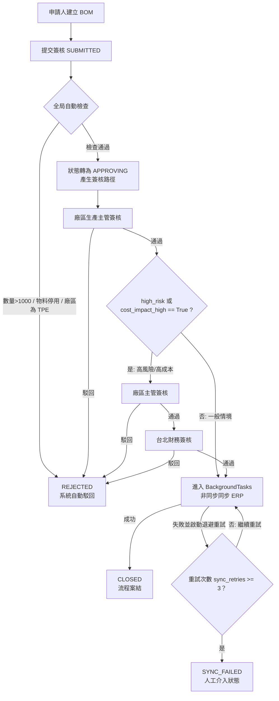

### 5.4 物料轉移簽核流程

**物料轉移簽核路徑邏輯（`_build_transfer_steps`）**：

1. **第一關（核心關卡）**：不論何種調撥情境，第一關原則上固定由發起調撥的**來源廠倉庫主管**（`source_site`）進行首關審核，確認出庫合理性與在庫可用量。但若來源廠為總公司（`source_site == "TPE"`），因其無實體倉儲編制，系統自動將首關改由**台北財務**行使出庫審核職能。
2. **跨廠區且目的地非總公司**（`source_site != target_site` 且 `target_site != "TPE"`）：若調撥涉及台南廠與高雄廠之間的實體移轉，系統將自動加簽**目標廠倉庫主管**，用以確認目的地之庫容與進庫合理性。
3. **終審控制點**：所有物料轉移單在人工關卡的最後一關，一律必須由**台北財務**進行終審，以落實跨廠/廠內資產異動的價值覆核與會計帳務稽核。若調撥的目標廠區為 `TPE`（例如寄回總公司的樣品或待檢退貨），因 TPE 無實體倉儲編制，系統自動豁免目標廠倉庫主管，直接由台北財務行使雙重覆核職能。

| 轉移情境 | 適用情境與說明 | 具體動態簽核路徑 |
| :--- | :--- | :--- |
| **同廠區轉移** | 台南廠內或高雄廠內之倉庫間調撥 (`source_site == target_site`) | 來源廠倉庫主管 $\rightarrow$ 台北財務 $\rightarrow$ `會計系統自動同步` |
| **跨廠區轉移 (非 TPE)** | 台南廠與高雄廠之間的雙向物料調撥 | 來源廠倉庫主管 $\rightarrow$ 目標廠倉庫主管 $\rightarrow$ 台北財務 $\rightarrow$ `會計系統自動同步` |
| **跨廠區轉移 (涉 TPE)** | 將物料轉移至總公司台北場 (如樣品/退貨) | 來源廠倉庫主管 $\rightarrow$ 台北財務 $\rightarrow$ `會計系統自動同步` <br>*(自動豁免目標廠關卡)* |

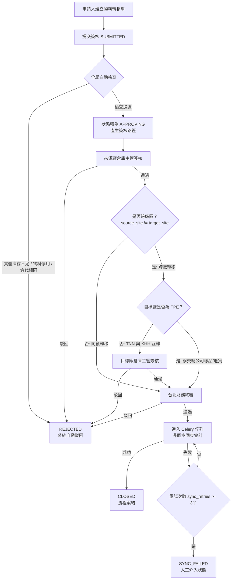

### 5.5 單據撤回機制 (Cancellation)

1. 當單據處於 SUBMITTED（自動檢查中）或 APPROVING（主管審核中）狀態，且尚未完成會計同步前，申請人具備隨時終止工作流的最高權限。
2. 申請人主動點擊「撤回」後，系統觸發 cancel 行為。
3. 系統將單據狀態立即變更為 CANCELED，中斷後續的所有簽核任務與自動催辦排程。
4. 通知連動阻斷機制：為防範組織內資訊不對稱，系統將自動發送系統通知（Notification）：
   - 告知先前關卡「已點擊同意的主管」，此單據已被申請人撤回作廢。
   - 移除當前「待簽核主管」工作台上的待辦事項，並發信通知無需繼續審核。
5. 狀態變更為 CANCELED 後，該單據即遭到唯讀鎖定，不可重新提交或修改，僅供內控審計與歷史稽核留存。

### 5.6 修改重提機制 (Revise)

1. 當單據不幸遭到人工關卡主管駁回或系統自動駁回，狀態變更為 REJECTED 時。
2. 申請人點擊「修改重提」，系統呼叫 `revise` 操作。
3. 歷史解耦與重置規範：系統將單據狀態從 REJECTED 重置回 DRAFT。為了給予申請人乾淨的重新編輯空間，系統將物理清除主檔上的 approved_by、rejection_reason，並整批刪除原生的 APPROVAL_STEP 動態關卡紀錄。(註：先前的所有審核意見與駁回軌跡，已由系統安全地封裝並完整保留於 Append-only 的 APPROVAL_LOG 中，絕不遺失。)
4. 申請人於 DRAFT 狀態修正明細內容後，可再度執行提交，系統將依據修正後的最新欄位，重新走過 4.1 節自動檢查並動態生成全新的簽核路徑。

## 6. 廠區簽核情境

### 6.1 總公司台北場 (TPE)
總公司台北場定位為全局營運管理、內控合規與財務結算中心，在現實業務中百分之百不經手、亦不開放發起任何生產用 BOM 單。若系統出現涉及台北場的單據，僅限於以下物流調撥情境：

台南廠或高雄廠因商務行為、樣品檢驗或待檢退貨，需要將實體物料跨廠轉移至總公司台北場。

由於台北場不配置實體生產線或大宗倉儲主管，因此當調撥單目標廠區為 TPE 時，系統自動豁免目標廠倉庫主管關卡，改由台北財務行使雙重覆核與價值把關職能。同理，若 TPE 作為來源廠發起轉移，首關審核也自動改由台北財務執行。

### 6.2 台南廠

台南廠為核心生產基地，具備全功能單據發起權限。

   - BOM 單：預設由台南廠生產主管審核；若觸發風險或成本旗標，則依序升級至台南廠區主管與台北財務。

   - 物料轉移：可處理台南廠內倉庫間的調撥，或調撥至高雄廠的跨廠流程。

### 6.3 高雄廠

高雄廠定位為生產與大型大宗倉儲基地，同樣具備完整的單據發起與實體用料審核職能。

   - BOM 單：由高雄廠生產主管進行首關結構與排程合理性審核。

   - 物料轉移：負責大宗倉儲調撥的審核。當高雄廠發起跨廠支援台南廠的調撥單時，需由高雄倉庫主管（出庫審核）與台南倉庫主管（進庫審核）雙向簽認，最終送台北財務核帳。

## 7. 狀態定義與操作矩陣

系統採嚴格的狀態機（State Machine）控管，單據在特定狀態下僅允許執行合規的 API 操作，全面禁止越權操作：

| 狀態碼 (Status) | 商業與系統說明 | 允許之操作 (Allowed Actions) |
| :--- | :--- | :--- |
| **DRAFT** | 草稿狀態。由申請人剛建立（BOM 限定 TNN/KHH 廠區，轉移單支援三廠區），或被駁回後透過「修改重提」恢復之單據，此時欄位資料允許修改。 | `Update` (更新欄位), `Delete` (刪除草稿), `Submit` (提交簽核) |
| **SUBMITTED** | 已提交。等待簽核引擎呼叫 ERP 進行背景全局防呆檢查（包含 TPE 不准建立 BOM 之檢核）。 | `Cancel` (申請人撤回) |
| **APPROVING** | 多關人工簽核中。簽核引擎已依規則動態產生審核步驟隊列，等待各關卡主管簽認。 | `Approve` (主管同意), `Reject` (主管駁回), `Cancel` (申請人撤回) |
| **APPROVED** | 所有人工關卡全數通過。單據全面鎖定，進入系統背景 Celery 佇列等待同步至會計 ERP。 | 無人工作權限 (系統非同步背景鎖定中) |
| **REJECTED** | 已駁回（含主管人工駁回與系統自動防呆攔截駁回），單據內必須帶有明確的駁回原因。 | `Revise` (修改重提，重置為 DRAFT) |
| **CLOSED** | 結案。外圍會計系統 API 成功接收資料並回傳憑證編號。此狀態為最終唯讀狀態。 | 唯讀 (系統封存，不可進行任何異動) |
| **CANCELED** | 已撤回。申請人在審核結束前主動作廢之單據，不可再次編輯或重提。 | 唯讀 (僅供內控審計與歷史稽核) |
| **SYNC_FAILED**| 同步永久失敗。Celery 背景自動重試 3 次皆失敗，急需人工介入排除外圍系統障礙。 | `Sync_Retry` (限台北財務與系統管理員手動執行重試) |

**狀態轉移圖**：

```mermaid
stateDiagram-v2
    [*] --> DRAFT : 建立單據 (BOM限TNN/KHH; 轉移單支援三廠)
    DRAFT --> [*] : 申請人刪除草稿
    
    DRAFT --> SUBMITTED : 申請人提交
    SUBMITTED --> REJECTED : 自動防呆駁回 (如庫存不足、TPE違規建BOM)
    SUBMITTED --> CANCELED : 申請人主動撤回 (自動檢查前/中)
    
    SUBMITTED --> APPROVING : 自動檢查通過，動態產生簽核路徑
    
    APPROVING --> APPROVING : 中間關卡主管同意 (繼續流轉)
    APPROVING --> REJECTED : 任一人工關卡主管駁回
    APPROVING --> CANCELED : 申請人主動撤回 (簽核結束前)
    APPROVING --> APPROVED : 所有關卡核准通過 (進入背景佇列)
    
    APPROVED --> CLOSED : 外部系統 (會計/ERP) 同步成功
    APPROVED --> SYNC_FAILED : 背景退避重試 3 次皆失敗
    
    SYNC_FAILED --> CLOSED : 台北財務/管理員 手動重試成功
    
    REJECTED --> DRAFT : 申請人執行「修改重提」 (重置單據歷程)
    
    CLOSED --> [*] : 流程案結，唯讀鎖定
    CANCELED --> [*] : 永久作廢，僅供稽核
```

## 8. 資料模型與資料流

### 8.1 實體關聯圖 (ER Diagram)

核心資料庫關聯設計如下。系統在 `SIGNOFF_DOCUMENT` 引入樂觀鎖 (`version` 欄位)，以處理多位使用者同時操作同一張單據的併發 (Concurrency) 問題。為確保規格一致性，明細實體全面對齊前文欄位需求命名。

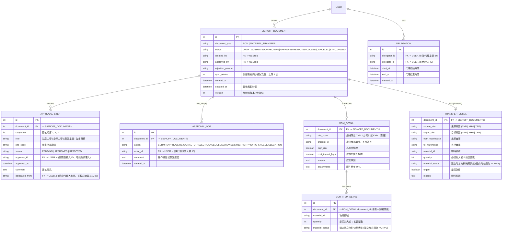

> **注意**：`APPROVAL_LOG` 為 **Append-only**（僅限追加），系統不提供任何 Update 或 Delete 端點，任何人（包含系統管理員）均不得修改或刪除，以確保全局電子簽核的不可篡改性與內控稽核追溯效力。

### 8.2 系統互動資料流

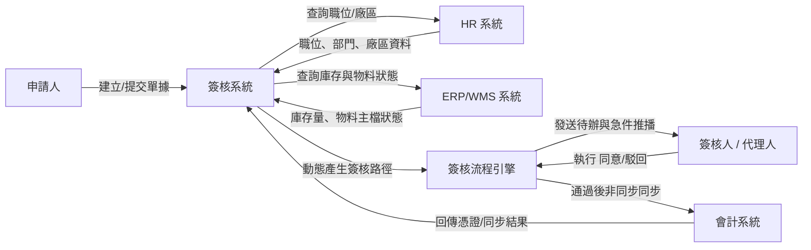

## 9. 外部系統互動

本系統作為核心簽核中樞，需與企業內部的 ERP、WMS、HR 以及會計系統進行即時與非同步的資料互動。

### 9.1 ERP / WMS 系統 (庫存與物料主檔)

**查詢 API**（即時呼叫，提交簽核時使用）：

```http
GET /api/erp/materials/{material_id}/inventory?site={site_code}
```

系統在提交簽核時，會即時呼叫此 API 確認：
- 「數量是否超過安全上限」
- 「物料狀態是否停用」
- 「庫存是否不足」（物料轉移時）

> **現行模擬**：`MockERPService` 維護靜態物料庫存表，含以下測試物料：`M-CPU-INTEL`、`M-GPU-NVIDIA`、`M-RAM-64G`、`M-SCREW-01`、`M-PANEL-15`（均 ACTIVE）；`M-DEPRECATED`（DISABLED）。

**庫存生命週期管理 API**（限物料轉移單，非同步呼叫）：

| 命令 | Endpoint | 觸發時機 |
| :--- | :--- | :--- |
| **預占 (Reserve)** | `POST /api/erp/inventory/reserve` | 申請人成功提交，自動檢查通過後 |
| **扣除 (Deduct)** | `POST /api/erp/inventory/deduct` | 所有人工關卡簽核全數通過 (`APPROVED`) 時 |
| **釋放 (Release)** | `POST /api/erp/inventory/release` | 已預占的單據後續遭駁回或撤回時 |

請求範例（預占/扣除/釋放共用此格式）：

```json
{
  "document_id": "MATERIAL_TRANSFER-20260630-001",
  "source_site": "TNN",
  "from_warehouse": "WH-TNN-A",
  "material_id": "M-CPU-INTEL",
  "quantity": 150
}
```

- **預占失敗**：若預占 API 回傳失敗（如庫存不足），系統自動觸發 `AUTO_REJECT`，單據狀態直接轉為 `REJECTED`。
- **釋放失敗**：釋放指令透過非同步佇列執行，若失敗應具備自動重試機制，防止產生死庫存。

### 9.2 HR 系統

```http
GET /api/hr/users/{user_id}
```

回應範例：

```json
{
  "user_id": "PM-TNN",
  "name": "台南生產主管",
  "position": "生產主管",
  "department": "生產部",
  "site_code": "TNN",
  "site_name": "台南廠"
}
```

### 9.3 會計系統 (限物料轉移單)

```http
POST /api/accounting/sync
```

請求範例：

```json
{
  "transaction_id": "MATERIAL_TRANSFER-20260622-001",
  "document_type": "MATERIAL_TRANSFER",
  "source_site": "TNN",
  "target_site": "KHH",
  "from_warehouse": "WH-TNN-A",
  "to_warehouse": "WH-KHH-B",
  "material_id": "M-CPU-INTEL",
  "quantity": 150,
  "status": "APPROVED",
  "approved_steps": [
    "TNN_WAREHOUSE_MANAGER",
    "KHH_WAREHOUSE_MANAGER",
    "TPE_FINANCE"
  ]
}
```

非同步容錯控制：

   - 同步成功：會計系統 API 回傳 HTTP 200 (Success) 並附加憑證編號，本系統單據狀態隨之變更為 CLOSED（案結）。

   - 失敗：若發生連線逾時或外圍系統異常，本系統單據狀態維持在 APPROVED 並自動計入重試佇列（sync_retries 遞增），直至連續失敗 3 次後強制轉為 SYNC_FAILED，解鎖人工介入按鈕。

### 9.4 ERP 系統 (生產模組，限 BOM 單)

```http
POST /api/erp/bom/sync
```

針對簽核通過之 BOM 單，系統非同步呼叫此 API，將最新物料結構與標準成本更新至 ERP，但不產生會計分錄。

請求範例：

```json
{
  "transaction_id": "BOM-20260630-001",
  "document_type": "BOM",
  "site_code": "TNN",
  "product_id": "PROD-A001",
  "status": "APPROVED",
  "high_risk": true,
  "cost_impact_high": true,
  "items": [
    {
      "material_id": "M-CPU-INTEL",
      "quantity": 2,
      "material_status": "ACTIVE"
    },
    {
      "material_id": "M-RAM-64G",
      "quantity": 4,
      "material_status": "ACTIVE"
    }
  ],
  "approved_steps": [
    "TNN_PRODUCTION_MANAGER",
    "TNN_SITE_DIRECTOR",
    "TPE_FINANCE"
  ]
}
```

非同步容錯控制：連續重試失敗 3 次後，單據狀態強制轉為 `SYNC_FAILED`，解鎖台北財務與管理員的手動重試按鈕。

## 10. 通知與追蹤

系統整合了多種通知管道（內部站內信 In-App Bell、Email、企業通訊軟體 Webhook），以確保簽核時效性，並防止資訊滯留。

### 10.1 事件與通知對象對照表

| 觸發事件 (Events) | 通知管道 (Channels) | 主要通知對象 (Recipients) | 精準通知內容範例 (Notification Templates) |
| :--- | :--- | :--- | :--- |
| **單據提交** | Bell + Email <br>*(若為急件加發 Webhook)* | 下一關簽核主管 <br>*(BOM 限定 TNN/KHH 生產主管；<br>轉移單為來源廠倉庫主管)* | `【待簽核提醒】您有一筆來自 {申請人} 的 {單據類型} 待審核。廠區：{site_code}。單號：{doc_id}。` <br>*(急件將於 Teams/Slack 推播並附加一鍵審核超連結)* |
| **簽核通過**<br>*(中間關卡)* | Bell | 下一關之待簽核主管 | `【簽核進度通知】單號 {doc_id} 已由前關主管同意，目前已送達您的待辦清單，請撥冗審核。` |
| **簽核通過**<br>*(最終關卡)* | Bell + Email | 申請人、台北財務 | `【簽核結案通知】您申請的單據 {doc_id} 已通過最終審核，系統正非同步同步至外部系統中。` |
| **自動防呆駁回** | Bell + Email | 申請人 | `【系統自動駁回】您提交的單據 {doc_id} 未通過自動防呆校驗。原因：{rejection_reason}。單據已退回草稿匣。` |
| **主管人工駁回** | Bell + Email | 申請人 | `【簽核駁回通知】您的單據 {doc_id} 已被 {主管姓名}({主管職位}) 駁回。駁回原因：{comment}。請執行修改重提。` |
| **申請人撤回** | Bell | 申請人（撤回確認）<br>簽核鏈上所有相關主管 <br>*(含已簽核與當前待簽核主管)* | 申請人：`【撤回成功】單據 {doc_id} 已成功撤回作廢，狀態已轉為 CANCELED。` <br>主管：`【單據撤回通知】單號 {doc_id} 已由申請人主動作廢撤回，目前已從您的待辦工作台中移除，無需執行審核。` |
| **外部系統同步成功** | Bell + Email | 申請人、台北財務 | `【同步成功】單據 {doc_id} 已順利寫入外部系統。憑證編號：{voucher_id}，單據狀態已更新為 CLOSED。` |
| **外部系統同步永久失敗** | Webhook (高優先) | 台北財務、系統管理員 | `【嚴重錯誤告警】單據 {doc_id} 連續自動重試同步 3 次皆失敗。狀態已轉為 SYNC_FAILED，請管理員立即介入排除。原因：{error_msg}。` |

---

### 10.2 簽核時效 (SLA) 與動態催辦機制

為了落實跨廠區高效協作，系統針對人工簽核關卡引入服務水準協定（SLA）逾期監控：

1. **一般催辦 (SLA T1)**：
   若某張單據在某一主管的人工待辦匣中停滯超過指定時效（預設為 3 天，後端參數 `sla_days = 3`），簽核引擎將於每日凌晨自動觸發逾期催辦，同時向該名主管發送 **Email 催辦信**。
2. **升級呈報 (Escalation T2)**：
   若主管接收到 T1 催辦信後，再經過 **2 天**（即自單據進入該關卡起，總停滯滿 **5 天**）仍未處理，系統會將該單據標記為「嚴重逾期」，催辦權限升級（Escalation）。此時系統將繞過 Email，改以**高優先級之企業通訊軟體 Webhook**，直接在該廠區的主管群組（或對接管理員工作台）進行強制推播催辦。
3. **現行手動排程觸發點**：
   目前階段系統提供特權管理端點，允許系統管理員手動呼叫執行：
```http
POST /api/admin/trigger-sla-check?sla_days=3
```

## 11. 網頁功能需求

簽核系統需提供申請、查詢、簽核、追蹤與管理等頁面。各頁面需依使用者角色與所屬廠區顯示不同資料範圍。

### 11.1 首頁 / 儀表板

使用者登入後進入首頁，系統依 HR 資料判斷使用者角色、職位與廠區。

| 功能 | 說明 |
| --- | --- |
| 待我簽核 | 顯示目前登入者需要處理的 BOM 或物料轉移單（依 `current_step.role` 與 `site_code` 比對登入者資訊） |
| 已核准 | 顯示使用者自己建立且已核准（APPROVED/CLOSED）的單據 |
| 我的草稿 | 顯示使用者自己建立的 DRAFT 單據 |
| 遭駁回 | 顯示使用者自己建立的 REJECTED 單據 |
| 快速建立 | 提供建立 BOM、建立物料轉移的入口。*(註：若登入者廠區為 TPE，則「建立 BOM」按鈕強制置灰封鎖)* |

**資料可視範圍規則**（前端 `isDocVisibleToUser`）：

| 角色與廠區 | BOM 可見範圍 | 物料轉移可見範圍 |
| --- | --- | --- |
| **TPE 台北財務** | 涉及高風險/高成本之 BOM 單，**或狀態為 `SYNC_FAILED` 之單據** | `source_site==TPE` 或 `target_site==TPE` 或 跨廠移轉 |
| **TNN / KHH 生產主管** | `site_code` 等於本廠區 | 無檢視權限 |
| **TNN / KHH 倉庫主管** | 無檢視權限 | `source_site` 或 `target_site` 等於本廠區 |
| **TNN / KHH 廠區主管** | `site_code` 等於本廠區 *(一般單唯讀，高風險可簽核)* | 無檢視權限 |
| **系統管理員** | 全局可見 | 全局可見 |
| **自己建立的單據** | 永遠可見 | 永遠可見 |

頁面連動：

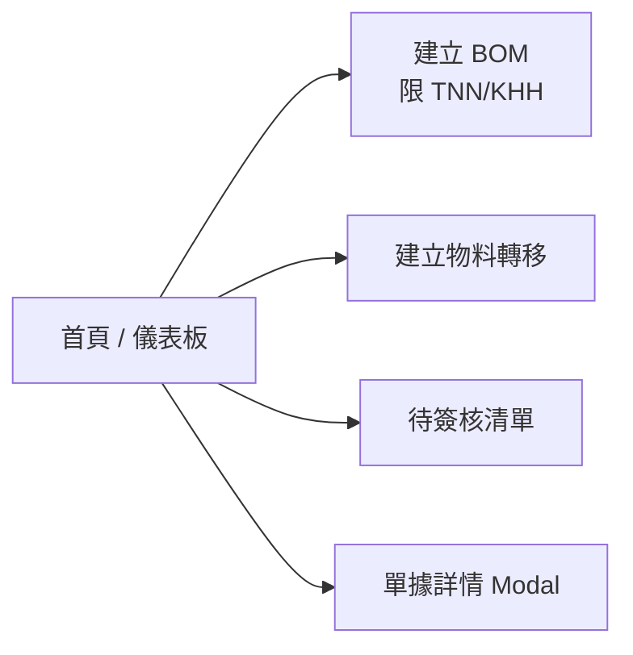

### 11.2 BOM 建立頁

申請人可建立 BOM 單，填寫產品、物料清單與建立原因。

| 功能 | 說明 |
| --- | --- |
| 選擇廠區 | 嚴格限制登入者必須為 TNN 或 KHH 廠區人員。系統自動帶入所屬廠區且不可修改；總公司 TPE 員工不開放進入此頁面。 |
| 填寫 BOM 資料 | 產品 ID（必填）、多項物料（物料 ID + 數量 + 狀態）、高風險旗標、成本影響旗標、建立原因、附件 URL |
| 動態新增/刪除物料 | 點擊「＋ 新增物料」可增加物料列；至少保留一項。一筆 BOM 單允許包含多項物料（一對多）。 |
| 簽核路徑預覽 | 填寫欄位與勾選風險/成本旗標後，前端依公式即時動態計算並預覽顯示簽核路徑關卡。 |
| 暫存草稿 | 將資料儲存，建立或更新 `DRAFT` 單據 |
| 提交簽核 | 建立後立即觸發自動檢查與簽核路徑產生 |
| 附件上傳 | 可輸入需求單、規格文件或成本說明的 URL |

頁面連動：

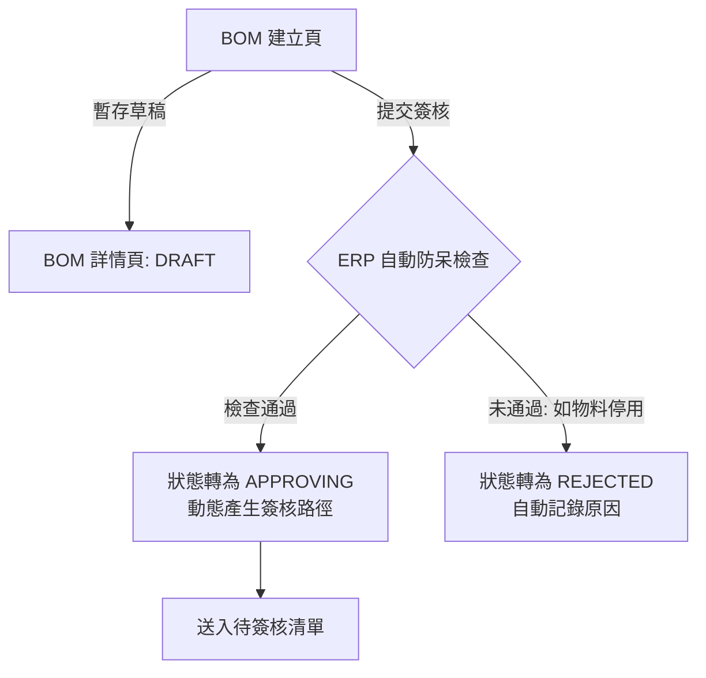

### 11.3 物料轉移建立頁

申請人可建立廠內或跨廠區物料轉移單。

| 功能 | 說明 |
| --- | --- |
| 選擇來源廠區/倉庫 | 預設為申請人所屬廠區（支援 TNN / KHH / TPE 廠區），可選擇該廠區名下之儲位倉庫。 |
| 選擇目標廠區/倉庫 | 由使用者選擇移入之目標。若來源與目標廠區不同，系統判定為跨廠區流程。 |
| 填寫物料資料 | 物料 ID、數量（必須為大於 0 的正整數）、物料狀態、轉移原因、是否急件標記。 |
| 簽核路徑預覽 | 依據「來源廠」與「目標廠」的組合，即時在 UI 預覽動態簽核路徑（同廠 vs 跨廠非 TPE vs 跨廠目標為 TPE）。 |
| 提交簽核 | 點擊提交後將單據送出，並於背景非同步執行 ERP 實體可用庫存量校驗。 |

頁面連動：

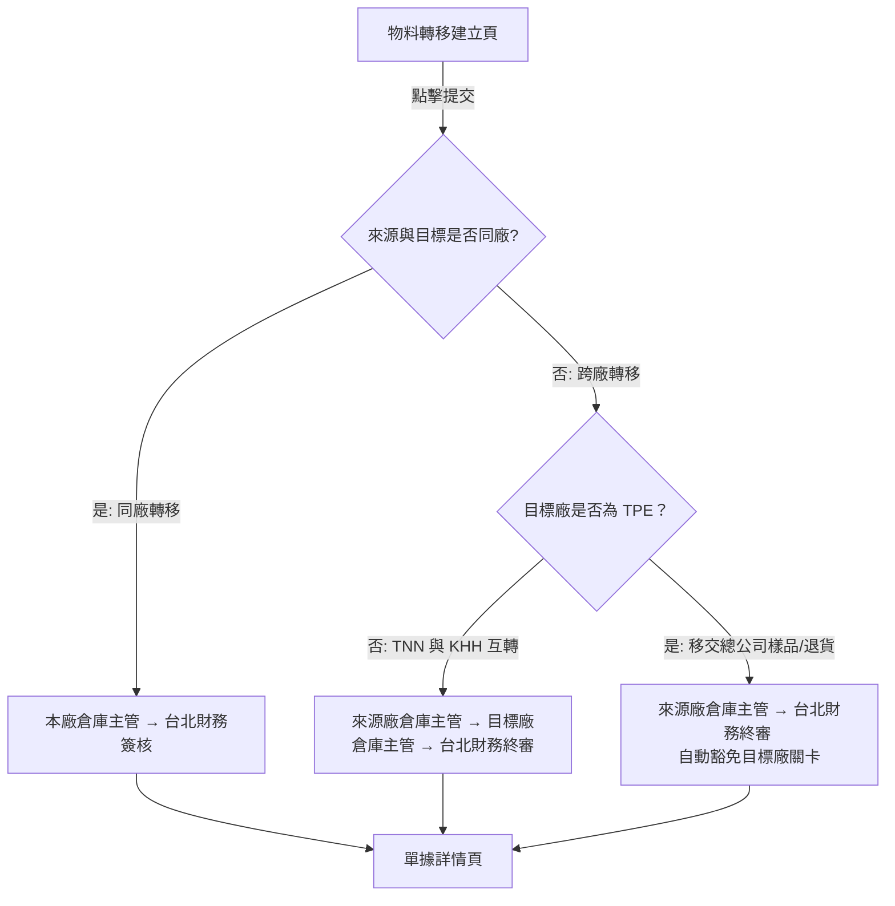

### 11.4 待簽核清單頁

簽核人使用此頁處理待簽核單據。

| 功能 | 說明 |
| --- | --- |
| 清單篩選 | 依單據類型（BOM / 物料轉移 / 全部）與單據編號進行快速篩選。 |
| 簽核優先排序 | 依系統識別度排序：急件標記 (urgent==true)、跨廠區單據、即將逾期（SLA 停滯天數高）之單據優先置頂，其餘依 ID 倒序。 |
| 批次檢視 | 提供摘要檢視模式，可一次查看多張單據之主檔摘要。 |
| 直接同意/駁回 | 清單頁右側提供快速操作按鈕，操作「同意」或「駁回（需填寫原因）」時無需強迫進入詳情頁。 |
| 進入詳情 | 點選「詳情」後以 Modal 彈窗呈現該單據的完整結構與明細。 |

頁面連動：

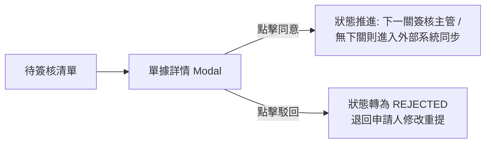

### 11.5 單據詳情頁（Modal）

所有角色都會使用此頁查看單據完整資訊。可執行的按鈕依角色、狀態與簽核關卡不同而變化。

| 功能 | 說明 |
| --- | --- |
| 基本資料 | 顯示單據類型、單號、廠區、建立人、建立時間、目前狀態、樂觀鎖版本（version）。 |
| 明細資料 | BOM 模式：顯示所有物料項目清單（物料 ID、數量、 Master 狀態）；物料轉移模式：顯示來源與目標廠區/倉庫、急件標記。 |
| 簽核路徑進度條 | 視覺化橫向或縱向步驟條，清楚標示每一關角色、廠區、實際簽核人、簽核時間、審核意見。若由代理人執行，該關卡需醒目顯示「代理人代簽」徽章。 |
| 操作紀錄歷程 | 展開顯示該單據所有唯讀之 APPROVAL_LOG（含動作類型、操作人、時間、備註原因），此處資料為追加模式（Append-only）。 |
| 同意 | 當單據處於 APPROVING 且輪到當前登入者審核時（isPendingForMe == true）顯示。點擊後扣鎖送出。|
| 駁回 (Button) | 當 isPendingForMe == true 時顯示。點擊後彈出必填對話框，強迫輸入駁回原因。 |
| 修改重提 (Button) | 當單據處於 REJECTED 狀態，且登入者為單據「建立人」時顯示。點擊後進入編輯模式，單據狀態重置為 DRAFT。 |
| 撤回 (Button) | 當單據處於 SUBMITTED 或 APPROVING 狀態，且登入者為單據「建立人」時顯示。點擊後中止流程轉為 CANCELED。 |
| 重試外部同步 | 當單據處於 SYNC_FAILED 狀態，且登入者角色為 台北財務 或 系統管理員 時顯示。點擊後觸發 Sync_Retry 背景重新同步。 |
| 關閉 | 關閉 Modal 視窗，不影響任何狀態。 |

頁面連動：

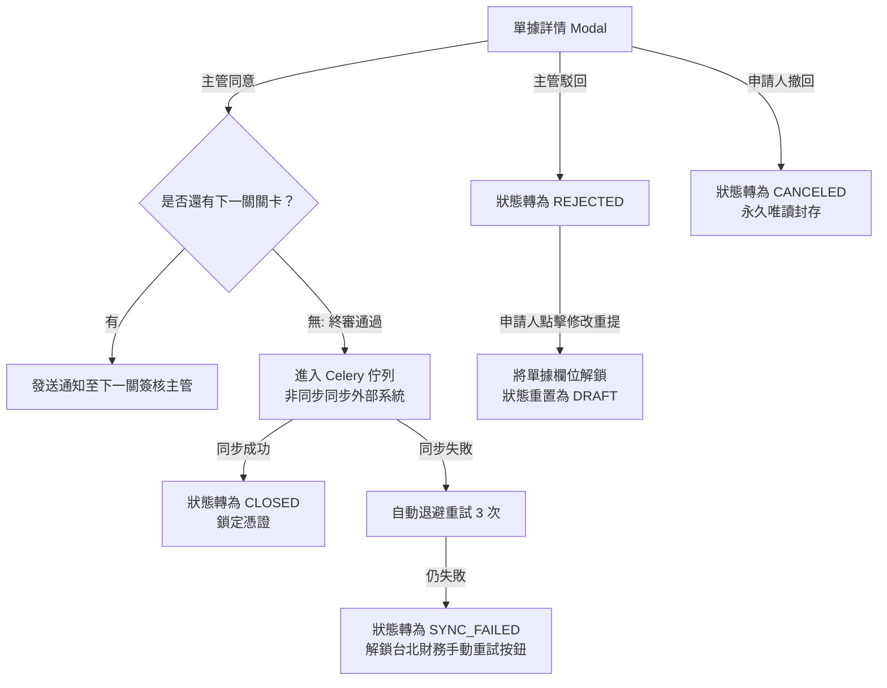

### 11.6 查詢與追蹤頁

提供申請人、主管、財務與系統管理員追溯歷史單據與稽核使用。

| 功能 | 說明 |
| --- | --- |
| 多條件複合查詢 | 支援依單據類型、單據編號、發起廠區、日期區間、目前狀態進行複合查詢。若所有查詢欄位留空，系統後端將強制依據 `isDocVisibleToUser` 權限矩陣進行過濾，僅展開顯示該登入者可見的單據。 |
| 查看詳情 | 點擊查詢結果列表之資料列，即可喚起「11.5 單據詳情 Modal」進行完整檢視。 |
| 進度追蹤 | 透過詳情 Modal 的簽核進度條，即時觀測單據目前正卡在哪個廠區的哪一位主管帳號中，便於線下溝通。 |

---

### 11.7 管理設定頁

此頁限**系統管理員**與**台北場管理角色**登入後方可於側邊欄檢視並進入，一般廠區使用者權限不足時不予顯示入口。

| 功能 | 說明 |
| --- | --- |
| SLA 催辦排程觸發 | 在尚未全面掛載 Cron Job 自動排程的現行過渡階段，提供後台手動特權觸發點。點擊按鈕後，前端發送 `POST /api/admin/trigger-sla-check?sla_days=3`，強制後端立刻掃描並補發逾期催辦信與 Webhook 升級呈報。 |

---

### 11.8 個人設定頁（代理人設定）

提供各廠區主管因公出差或請假時，自行維護與規劃自身的動態代理機制，以防工作流因人不在而停滯。

| 功能 | 說明 |
| --- | --- |
| 代理人設定 | 主管可自行選擇合規的同仁帳號作為代理人，並設定精準的效期區間（代理開始時間 至 代理結束時間）。 |
| 清除代理設定 | 可隨時手動廢止或清除尚未到期或進行中的代理人設定。 |

**代理人核心業務規則（後端引擎聯動）**：
- **覆蓋機制**：同一名主管在系統內僅允許保留最新的一筆有效代理設定（後端 `set_delegation` API 採 `delegator_id` 作為主鍵覆蓋更新，不產生歷史冗餘）。
- **時效判定**：代理權限無需人工人工手動啟用，由後端系統時間比對 `start_at <= 現在時間 <= end_at` 自動生效。
- **簽核權轉移**：當代理設定處於有效期間內，若有新單據提交並動態產生簽核關卡，簽核引擎會自動將該步驟的 `approver_id` 指向代理人，並在 `delegated_from` 記錄原始主管 ID。代理人登入後的「11.1 待我簽核」清單將自動出現該筆單據。
- **UI 徽章呈現**：代理人執行審核時，單據詳情頁的進度條與 `APPROVAL_LOG` 必須醒目渲染「代理人代簽」徽章，以符合內控審計規範。

## 12. 網頁功能連動總覽

本節彙整系統內各網頁功能頁面、彈窗（Modal）與核心狀態機之間的動態連動關係，作為前後端協作與整合測試之總綱。

### 12.1 整體網頁功能動態流

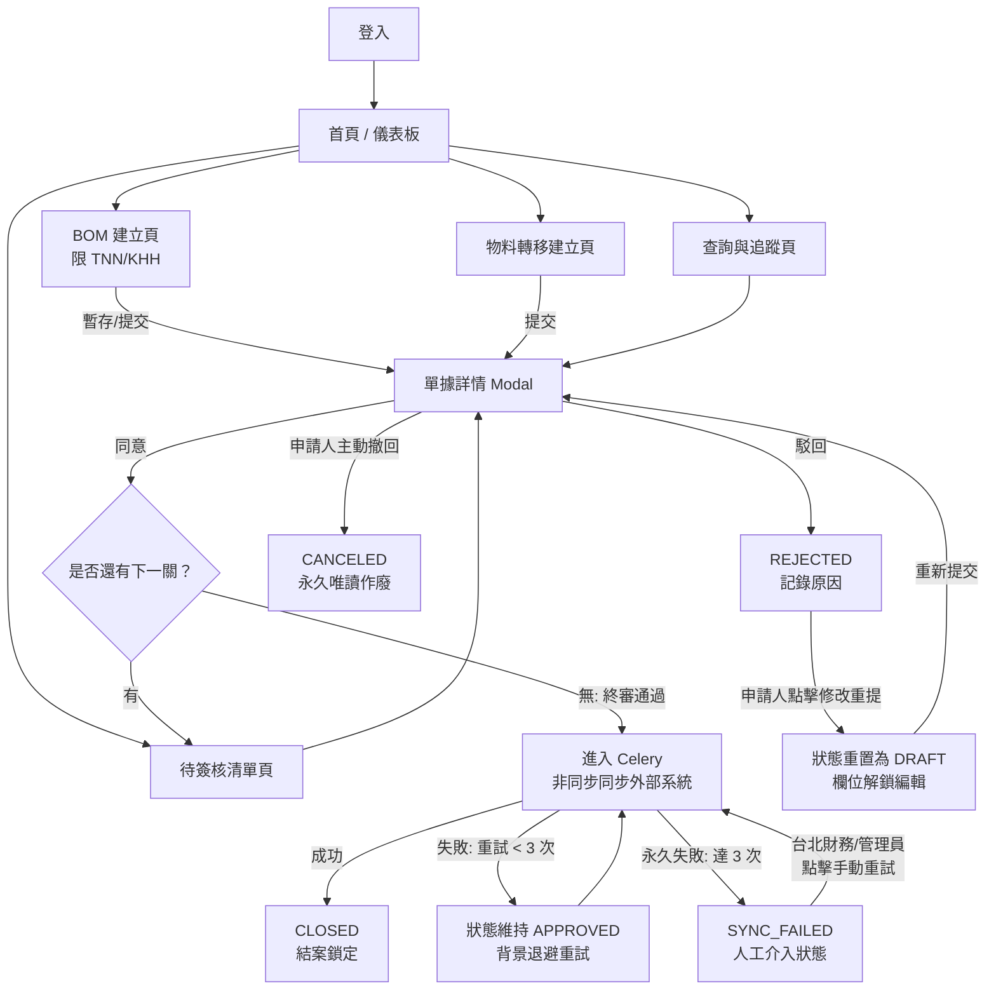

## 13. 權限與資料可視範圍 (RBAC/ABAC Matrix)

系統採「角色基礎權限（RBAC）」與「廠區屬性延伸（ABAC）」雙重驗證。後端 API 必須於 Middleware 節點強制執行下表之「資料可視邊界」與「動態 Action」檢查，嚴防越權橫向移動：

| 角色系統碼 (Role) | 資料可視範圍 (Data Visibility Boundary) | 允許執行之 API 動作 (Allowed Actions & Endpoints) |
| :--- | :--- | :--- |
| **申請人** <br>`APPLICANT` | 永遠僅能查看**自身建立**（`created_by == current_user.id`）的單據，不繼承廠區大盤檢視權。 | `Create` (建立), `Update` (暫存草稿/修改重提), `Submit` (提交), `Cancel` (主動撤回) |
| **生產主管** <br>`PRODUCTION_MANAGER` | 僅能查看與審核**所屬廠區（TNN 或 KHH）發起之 BOM 單**。不開放查看物料轉移單，亦不可查看 TPE 財務端單據。 | `Approve` (同意), `Reject` (駁回) <br>*(限該單據當前簽核步驟輪到自己時)* |
| **倉庫主管** <br>`WAREHOUSE_MANAGER` | 僅能查看與審核**所屬廠區（TNN / KHH / TPE）**作為「來源廠 `source_site`」或「目標廠 `target_site`」之物料轉移單。不開放查看任何 BOM 單。 | `Approve` (同意), `Reject` (駁回) <br>*(限該單據當前簽核步驟輪到自己時)* |
| **廠區主管** <br>`SITE_DIRECTOR` | 可查看**所屬廠區（TNN 或 KHH）發起之所有 BOM 單**。若觸發進階加簽（`high_risk` 或 `cost_impact_high` 為真），則具備簽核權限。不經手物料轉移單。 | `Approve` (同意), `Reject` (駁回) <br>*(限該單據當前簽核步驟輪到自己時)* |
| **台北財務** <br>`TPE_FINANCE` | 全局跨廠區最高資產檢視權：<br>1. 所有物料轉移單（因皆含財務終審）。<br>2. 涉及 `high_risk` 或 `cost_impact_high` 之 TNN/KHH 廠區 BOM 單。<br>3. **任何處於 `SYNC_FAILED` 狀態之單據**。 | 1. `Approve` / `Reject` (行使終審權)<br>2. **`Sync_Retry` (手動重試外部同步)** <br>*(限單據狀態處於 `SYNC_FAILED` 時)* |
| **代理人 (動態)** <br>`DELEGATED_APPROVER` | 於有效代理區間內（`start_at <= now <= end_at`），**暫時繼承「被代理主管」**所屬該筆單據的簽核與檢視權限。 | 繼承被代理人之 `Approve` 與 `Reject` 權限。*(系統將自動加掛 `delegated_from` 審計標籤，且不具備該主管的個人設定權)* |
| **系統管理員** <br>`SYS_ADMIN` | **不限廠區、不限類型之全局唯讀稽核權**。除測試外，常態下不參與日常業務之「同意/駁回」簽核。 | 1. `Sync_Retry` (手動重試外部同步)<br>2. `Trigger_SLA` (手動觸發 SLA 批次催辦)<br>3. 系統組態設定、維護 `DELEGATION` 表 |

### 13.1 代理權限特別約束

1. **禁止階層循環代理**：A 主管設定 B 為代理人時，系統必須檢查 B 目前的代理人是否為 A，若是則阻斷，防止簽核權限陷入無限死循環。
2. **動態稽核軌跡**：代理人執行 `Approve` 或 `Reject` 時，寫入 `APPROVAL_STEP` 的 `approver_id` 為代理人 UID，但 `delegated_from` 欄位必須寫入原主管 UID，提供外部稽核與不可篡改性證明。

### 14. 稽核紀錄 (Audit Logging Service)

本系統採嚴格的 **Append-only（僅限追加）** 稽核機制。任何引發單據狀態移轉、資料變更、或手動特權干擾之行為，後端均必須即時寫入 `APPROVAL_LOG` 資料表。資料庫層面全面封鎖對此表的 Update 與 Delete 權限，以供內外部合規審計稽核。

### 14.1 稽核紀錄欄位定義

每一筆日誌紀錄必須完整包含以下結構：
- **單據 ID (`document_id`)**：關聯之 `SIGNOFF_DOCUMENT` 主鍵。
- **操作動作 (`action`)**：嚴格限定為下表定義之系統標準 Action 枚舉值（Enum）。
- **操作人員 (`actor_id`)**：觸發該行為的使用者 ID（`USER.id`）。
- **操作時間 (`created_at`)**：後端資料庫寫入之系統絕對時間（Timestamp）。
- **操作備註 (`comment`)**：主管輸入之審核意見、系統自動駁回之原因、或 Celery 的錯誤 Exception 堆疊。

---

### 14.2 稽核動作 (Action Enum) 規範矩陣

| 動作代碼 (Action) | 觸發業務情境說明 | 備註與審計規範 |
| :--- | :--- | :--- |
| **SUBMIT** | 申請人於網頁點擊「提交簽核」。 | 代表工作流（Workflow）正式啟動。 |
| **APPROVE** | 簽核人（或代理人）執行「同意」操作。 | **審計約束**：若此步驟由代理人執行，`comment` 欄位必須自動由系統前綴加註 `[由代理人代簽，原始簽核主管: {delegator_id}]` 之防弊標籤。 |
| **REJECT** | 簽核人（或代理人）執行「駁回」操作。 | `comment` 欄位為強制必填，內容為審查退回之具體原因。 |
| **AUTO_REJECT** | 系統於背景自動檢查失敗（如庫存不足、物料停用、或 TPE 違規發起 BOM）執行強制攔截。 | `comment` 欄位將自動寫入外部系統回傳之錯誤代碼與阻斷理由。 |
| **CANCEL** | 申請人於結案前執行「撤回」操作。 | 系統中斷工作流，並記錄撤回日誌。 |
| **CLOSE** | 外部系統同步成功，單據正式案結。 | `comment` 欄位必須自動寫入外部系統回傳之「憑證編號（Voucher ID）」。 |
| **REVISE** | 申請人針對遭駁回的單據點擊「修改重提」。 | 此動作將使單據重置，解鎖表單並回到 DRAFT 狀態。 |
| **SYNC_RETRY** | 系統背景自動重試，或由台北財務/管理員點擊「手動強制重試」。 | 記錄每一次向外部系統重新遞送（Re-dispatch）資料的歷程。若手動重試成功，後續將自動追加產生一筆 `CLOSE` 紀錄。 |
| **SYNC_FAILED** | Celery 背景自動重試滿 3 次皆宣告失敗。 | 標記此單據正式陷入永久失敗，`comment` 內將記錄最後一次連線逾時或 API 回傳之 Error Body，以供管理員 debug。 |
| **DELEGATION** | 主管於「個人設定頁」中成功建立、修改或手動清除代理人設定。 | 用以追蹤組織內部簽核權限的移轉配置歷史，確保代理行為具備前置合規依據。 |

## 15. 例外處理與防呆邊界 (Exception Handling Matrix)

本節定義系統在面對外部系統異常、組織異動、併發衝突或違規操作等例外邊界情境時的系統行為與容錯規範：

| 例外情境 (Exception Scenarios) | 系統底層防禦與處理機制 (System Recovery & Handling) | 例外變更後之單據狀態 |
| :--- | :--- | :--- |
| **HR 系統查無簽核人職位** <br>*(如該廠區生產主管暫時懸缺)* | 系統無法動態建立簽核關卡。為防範工作流死鎖（Deadlock），背景引擎將**強制觸發自動駁回**。於 `comment` 記錄「HR 組織架構異常：查無指定職位」，並同步發送高優先級 Bell 通知系統管理員手動介入維護。 | 狀態轉為 **`REJECTED`** <br>*(退回草稿匣，供修復後重提)* |
| **找不到對應廠區最高主管** <br>*(BOM 觸發高風險加簽時)* | 處理機制同上。系統立即執行強制攔截，**拒絕讓單據懸空掛載**。自動駁回該單據，並同步發信給台北場系統管理員，要求進行 HR 權限矩陣校正。 | 狀態轉為 **`REJECTED`** |
| **外部系統非同步同步失敗** | 1. 單據狀態維持鎖定，**不開放任何一般人工作權限**。<br>2. 自動進入 Celery 重試佇列，計數器 `sync_retries` 遞增，並執行 3 次指數退避重試。<br>3. 若 3 次重試均失敗，**強制轉為 `SYNC_FAILED`**，解鎖台北財務與管理員的「手動強制重試（`Sync_Retry`）」按鈕。*(註：基於資料稽核一致性，此狀態下不開放手動終止或作廢功能)* | 狀態轉為 **`SYNC_FAILED`** <br>*(重試成功後方能轉為 `CLOSED`)* |
| **原簽核主管於簽核中離職/停用**| 簽核引擎於每日 SLA 掃描或主管點擊時重新驗證 UID。若發現該主管已於 HR 系統停用：<br>1. 系統自動查詢該主管是否配置處於有效期間內的「代理人」。<br>2. 若有代理人，自動將簽核權動態轉移給代理人。<br>3. 若無配置代理人，則工作流暫時掛起，發信告警管理員手動至後台變更該關卡的實際簽核人（`approver_id`）。| 狀態維持 **`APPROVING`** <br>*(由代理人或管理員介入接管)* |
| **物料轉移跨廠區其中一方駁回** | 不論是來源廠倉庫主管、目標廠倉庫主管或台北財務，人工關卡只要有任一方點擊「駁回」，工作流即刻宣告中止。系統發送通知給申請人，並要求必須執行「修改重提」以重置流程。 | 狀態轉為 **`REJECTED`** |
| **資料庫樂觀鎖衝突 (Concurrency)** | 當兩位主管同時對同一張單據點擊「同意」，或是申請人執行「撤回」與主管審核併發時：後端校驗 `version` 欄位失敗，拋出衝突異常。系統自動回滾該筆交易（Rollback），前端彈出 HTTP 409 錯誤提示：`「此單據剛剛已被其他使用者更新，請重新整理頁面。」` | 狀態維持在**衝突前的合法狀態** <br>*(強制使用者刷新畫面上岸)* |
| **ERP 實體可用庫存不足** <br>*(限物料轉移單)* | 於申請人點擊提交時由 `MockERPService` 即時攔截。系統立刻執行 **`AUTO_REJECT`**，並將 ERP 回傳之「現有可用庫存量」與「單據申請需求量」之詳細差額明細，完整寫入駁回原因歷程中。 | 狀態轉為 **`REJECTED`** |
| **台北場 (TPE) 違規發起 BOM 單**| 雖前端已置灰按鈕，若有使用者試圖繞過 UI 直接以 Postman/API 嘗試向 `/api/bom/` 發送 `site_code == "TPE"` 的請求，後端 Validator 將直接觸發 `ValidationError` 拋出 HTTP 400（BadRequest），阻斷寫入資料庫並在 API Response 回傳嚴格禁止警告。 | **拒絕寫入 / 直接攔截** <br>*(資料庫不產生任何髒資料)* |

## 16. 系統環境與架構組態約束 (System Architecture & Tech Stack)

本節定義系統實作時的後端框架、核心相依套件套件版本及基礎設施組態約束，確保非功能性需求（如第 12 節所述之樂觀鎖與 Celery 佇列）具備標準的運行環境。

### 16.1 後端核心技術棧與版控 (Tech Stack)

為確保開發品質與系統維護性，後端實作需嚴格遵循以下技術組態：
1. **開發框架**：採用 `Django 4.2+ (Python 3.10+)` 搭配 `Django REST Framework (DRF)` 構建 RESTful API 端點，發揮其成熟的 RBAC 權限管理與資料校驗優勢。
2. **ORM 實體映射**：採用原生的 `Django ORM`。
   - **樂觀鎖實作**：於 `SIGNOFF_DOCUMENT` 模型中維護整數型態的 `version` 欄位。進行單據審核與更新時，後端必須基於 `id` 與 `version` 作為複合條件進行更新，若查詢更新之影響行數為 0，則判定為併發衝突，並向前端拋出 HTTP 409（Conflict）錯誤。
3. **非同步任務引擎**：全面採用 `Celery` 搭配對應的 Message Broker（如 Redis）。用以負責執行外部系統非同步同步、重試退避策略，以及每日 SLA 逾期催辦排程，確保主要 API 的回應不被阻塞。

### 16.2 身分驗證與授權機制深度防禦 (SSO & Security)

1. **JWT 令牌簽發**：登入驗證需整合企業內部 SSO。系統應採用無狀態（Stateless）之 JWT 進行身份宣告，並於 Header 夾帶 `Authorization: Bearer <TOKEN>`。
2. **防範縱向/橫向越權**：
   - 後端身份驗證 Middleware 必須從解密後的 JWT 中直接提取 `user_id`（與內部 `actor_id` 對齊），禁止前端網頁直接傳遞 `actor_id` 欄位進行單據異動，徹底防範透過 Postman 竄改 Payload 進行越權操作。
   - 權限管理必須比對第 13 節之 RBAC/ABAC 權限矩陣，若廠區或角色不符，立刻阻斷並回傳 HTTP 403（Forbidden）。

### 16.3 日誌監控與稽核留存 (Logging & Monitoring)

1. **應用程式日誌 (Application Logs)**：
   後端必須掛載標準 `Loguru` 或 `Logging` 模組，對所有 API 請求（Request/Response）、Celery 任務執行歷程進行結構化（JSON 格式）日誌輸出，以便整合 ELK 或 Grafana Loki 進行中央日誌監控。
2. **審計日誌持久化**：
   如第 14 節所述，`APPROVAL_LOG` 為實體追加表。在資料庫層面（如 PostgreSQL / MySQL）必須透過資料庫角色帳號權限（Grants）進行嚴格控制，**生產環境（Production）之 API 服務帳號僅擁有對該表的 SELECT 與 INSERT 權限**，完全剝奪 UPDATE 與 DELETE 權限，以技術手段達成物理級別的不可篡改性。

## 17. API 端點總覽 (API Endpoints Specification)

本系統 API 採 RESTful 風格設計。為提升程式碼重用性，所有涉及工作流狀態機移轉（如核准、駁回、撤回等）之操作，一律收攏至通用單據（`/api/documents/`）端點處理，僅建立與草稿查詢保留專屬資源路由。

### 17.1 BOM 專屬單據端點

| HTTP 方法 | 路由路徑 (Route) | 動作說明 (Description) | 權限約束 (SLA / RBAC) |
| :--- | :--- | :--- | :--- |
| **GET** | `/api/boms` | 分頁列出 BOM 單摘要。支援依 `status`、`site_code` 篩選。 | 自動套用 `isDocVisibleToUser` 權限過濾 |
| **POST** | `/api/boms` | 建立全新 BOM 單明細。由 Payload 參數決定直接提交或暫存草稿。 | **限 TNN / KHH 廠區發起**（TPE 呼叫則回傳 HTTP 400） |
| **GET** | `/api/boms/{id}` | 取得指定 BOM 單的完整主檔與物料明細清單。 | 依廠區與自己建立進行隔離校驗 |
| **PUT** | `/api/boms/{id}` | 更新處於 `DRAFT` 或 `REJECTED`（修改重提）狀態的 BOM 欄位。 | 僅限單據建立人（申請人）操作 |

### 17.2 物料轉移專屬單據端點

| HTTP 方法 | 路由路徑 (Route) | 動作說明 (Description) | 權限約束 (SLA / RBAC) |
| :--- | :--- | :--- | :--- |
| **GET** | `/api/transfers` | 分頁列出物料轉移單。支援依 `status`、`source_site` 篩選。| 自動套用 `isDocVisibleToUser` 權限過濾 |
| **POST** | `/api/transfers` | 建立物料轉移單明細。即時觸發 ERP 可用庫存量校驗。 | 支援 TNN / KHH / TPE 三廠區發起 |
| **GET** | `/api/transfers/{id}`| 取得指定物料轉移單的完整調撥儲位、數量與急件標記。 | 依廠區與自己建立進行隔離校驗 |
| **PUT** | `/api/transfers/{id}`| 更新處於 `DRAFT` 或 `REJECTED` 狀態的物料轉移單欄位。 | 僅限單據建立人（申請人）操作 |

### 17.3 通用簽核工作流控制端點 (Workflow Core Engine)
*註：操作之 {id} 為父表 SIGNOFF_DOCUMENT.id，由後端統一執行樂觀鎖。*

| HTTP 方法 | 路由路徑 (Route) | 動作說明 (Description) | 權限與狀態機約束 (Constraint) |
| :--- | :--- | :--- | :--- |
| **POST** | `/api/documents/{id}/submit` | 將 DRAFT 草稿正式提交，觸發動態產生簽核路徑。 | 限建立人操作。狀態：DRAFT -> APPROVING |
| **POST** | `/api/documents/{id}/approve`| 當前步驟簽核主管（或有效代理人）執行「核准同意」。 | 限目前待辦主管。若無下關則觸發 Celery 背景同步。 |
| **POST** | `/api/documents/{id}/reject` | 當前步驟簽核主管（或有效代理人）執行「核准駁回」。 | 限目前待辦主管。Payload 之 comment 原因為必填。 |
| **POST** | `/api/documents/{id}/cancel` | 申請人於主管審畢前，主動作廢並「撤回」工作流。 | 限建立人操作。狀態：APPROVING -> CANCELED |
| **POST** | `/api/documents/{id}/revise` | 申請人針對被駁回單據點擊「修改重提」，重置路徑。| 限建立人操作。狀態：REJECTED -> DRAFT（欄位解鎖） |
| **POST** | `/api/documents/{id}/retry-sync`| 手動強制重新向外部系統發起非同步同步（Sync_Retry）。| 限台北財務或系統管理員。狀態必須為 SYNC_FAILED |

### 17.4 系統基礎設施與行政管理端點

| HTTP 方法 | 路由路徑 (Route) | 動作說明 (Description) | 備註 (Remarks) |
| :--- | :--- | :--- | :--- |
| **POST** | `/api/auth/login` | 提交企業 SSO 憑證或帳密，驗證成功回傳 JWT Bearer Token。| 全域開放（匿名端點） |
| **GET** | `/api/documents/{id}/logs` | 取得指定單據之完整唯讀審計操作歷程（`APPROVAL_LOG`）。 | 全角色開放（唯讀，依可視範圍隔離） |
| **POST** | `/api/users/me/delegation`| 主管自主規劃與維護自身的「動態代理人機制」。 | Payload 含 `delegate_id`, `start_at`, `end_at` |
| **DELETE** | `/api/users/me/delegation`| 主管提前「手動清除」或撤銷目前的代理人設定。 | 清除後立即收回代理人之待辦繼承權 |
| **POST** | `/api/admin/trigger-sla-check`| 手動特權觸發 SLA 停滯排程掃描（預設 `?sla_days=3`）。 | **嚴格限系統管理員與台北場管理角色** |
| **GET** | `/api/admin/external/sync-errors`| 查詢目前卡在 `SYNC_FAILED` 的異常單據與 Exception 堆疊歷程。| **限台北財務與系統管理員**稽核 debug 使用 |
