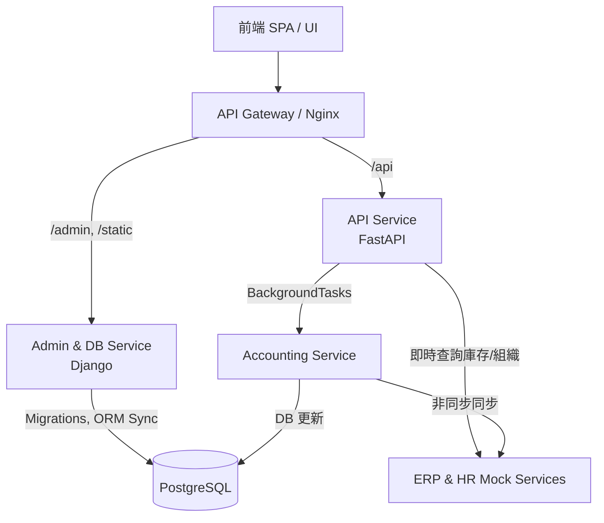
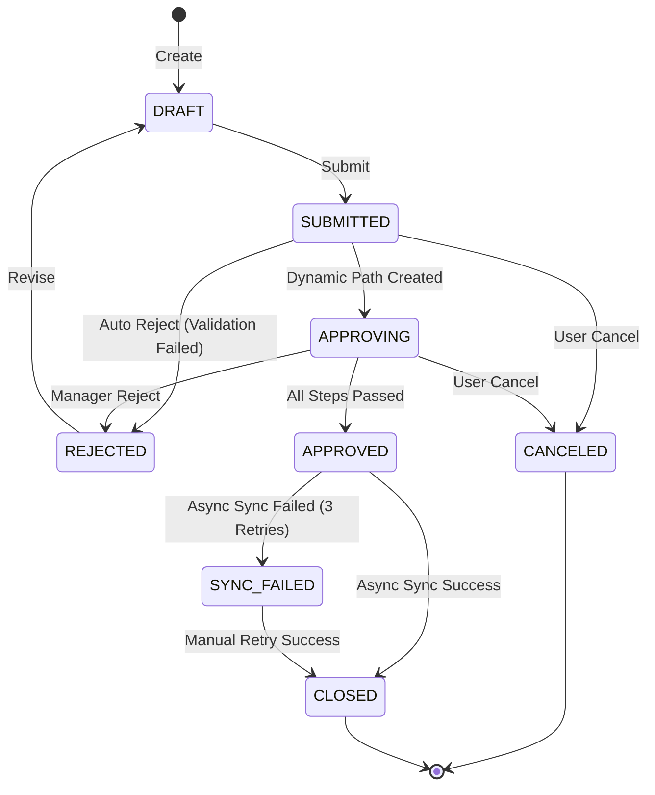

# 系統設計 (SD) 規格書：三廠區物流暨物料簽核系統

本系統設計規格書基於最新的系統分析 (SA) 文件撰寫，旨在指導後續的開發實作。全案將採取**測試導向開發 (TDD)** 流程，並採用 **Django + FastAPI 的微服務解耦 (Microservices)** 架構進行建置。

---

## 1. 系統架構設計 (Microservices Architecture)

本系統採前後端分離與後端微服務解耦架構，將系統職責劃分為「管理與數據層」與「高併發業務 API 層」。



### 1.1 服務權責劃分
*   **Admin & DB Service (Django)**：
    *   負責穩健的資料庫遷移 (Migrations)、Schema 管理。
    *   利用 Django Admin 提供強大的後台管理介面，供系統管理員維護基礎設定檔（如：廠區資料、預設權限）。
*   **API Service (FastAPI)**：
    *   負責所有面向前端的非同步 RESTful API (`/api/v1/...`)。
    *   管理簽核狀態機 (State Machine) 流轉。
    *   與外部 ERP / HR 系統進行 API 請求對接。
    *   負責會計系統的非同步同步，透過 FastAPI 內建的 `BackgroundTasks` 執行。

---

## 2. 測試導向開發流程 (TDD Methodology)

全案強制實施測試驅動開發，確保業務邏輯（特別是自動防呆與權限）的 100% 正確性。

### 2.1 測試技術棧
*   **核心框架**：`pytest`
*   **Django 測試**：`pytest-django`（處理 ORM 與 Migrations 測試）
*   **FastAPI 測試**：`pytest-asyncio`、`httpx`（處理 Async API 整合測試）
*   **Mocking**：使用 `unittest.mock` 模擬外部 ERP/HR API 與會計系統連線。

### 2.2 開發循環規範 (Red -> Green -> Refactor)
1.  **測試先行 (Red)**：在實作任何 API 之前，先撰寫會失敗的測試案例。
    *   *範例*：撰寫 `test_tpe_cannot_create_bom`，預期回傳 HTTP 400。
2.  **實作代碼 (Green)**：撰寫 FastAPI 路由與 Service 層邏輯，讓測試轉綠。
3.  **重構 (Refactor)**：優化程式碼，確保符合 PEP 8 規範且 Test Coverage 達到 80% 以上。

### 2.3 測試覆蓋重點
*   **權限與邊界測試**：驗證 `isDocVisibleToUser` 與不同角色調用 API 的 HTTP 403 阻斷。
*   **狀態機移轉測試**：測試從 `DRAFT` 到 `CLOSED` 或 `CANCELED` 的非法狀態移轉阻擋。
*   **併發測試 (Concurrency)**：利用 `asyncio.gather` 同時發送多個 `approve` 請求，驗證樂觀鎖 (`version`) 是否能正確拋出 HTTP 409 Conflict。

---

## 3. 資料庫結構 (Table Schema)

基於 Django Models 生成的資料表結構，FastAPI 則透過非同步 ORM (如 SQLAlchemy 2.0 Async 或 SQLModel) 反向對接相同的 Table。

### 3.1 基礎設定表

**users (使用者表 - 模擬自 HR 系統)**
| 欄位 | 型別 | 約束 | 描述 |
| :--- | :--- | :--- | :--- |
| `id` | integer | PK | 主鍵 |
| `user_id` | varchar(50) | UNIQUE, NOT NULL | 員工代號 (如 EMP001) |
| `name` | varchar(100) | NOT NULL | 姓名 |
| `position` | varchar(50) | NOT NULL | 職位 |
| `site_code` | varchar(10) | NOT NULL | 所屬廠區 (TNN/KHH/TPE) |

**delegations (代理人設定表)**
| 欄位 | 型別 | 約束 | 描述 |
| :--- | :--- | :--- | :--- |
| `id` | integer | PK | 主鍵 |
| `delegator_id` | varchar(50) | FK(users.user_id), UNIQUE | 被代理的主管 ID |
| `delegate_id` | varchar(50) | FK(users.user_id) | 代理人 ID |
| `start_at` | datetime | NOT NULL | 代理生效起始時間 |
| `end_at` | datetime | NOT NULL | 代理生效結束時間 |

### 3.2 簽核核心表

**signoff_documents (主單據表)**
*結合樂觀鎖的單據根實體。*
| 欄位 | 型別 | 約束 | 描述 |
| :--- | :--- | :--- | :--- |
| `id` | integer | PK | 主鍵 |
| `document_type` | varchar(30) | NOT NULL | `BOM` 或 `MATERIAL_TRANSFER` |
| `status` | varchar(20) | NOT NULL | DRAFT/SUBMITTED/APPROVING/APPROVED/REJECTED/CLOSED/CANCELED/SYNC_FAILED |
| `created_by` | varchar(50) | FK(users.user_id) | 發起人 |
| `version` | integer | NOT NULL, DEFAULT 1 | 樂觀鎖版本號 (Concurrency Control) |
| `sync_retries`| integer | NOT NULL, DEFAULT 0 | 會計同步重試次數 |
| `created_at` | datetime | NOT NULL, auto_now_add | 建立時間 |
| `updated_at` | datetime | NOT NULL, auto_now | 最後更新時間 |

**bom_details (BOM 單據屬性)**
| 欄位 | 型別 | 約束 | 描述 |
| :--- | :--- | :--- | :--- |
| `document_id` | integer | PK, FK(signoff_documents.id) | 單據 ID (一對一) |
| `site_code` | varchar(10) | NOT NULL | TNN 或 KHH |
| `product_id` | varchar(50) | NOT NULL | 產品編號 |
| `high_risk` | boolean | DEFAULT False | 高風險旗標 |
| `cost_impact_high`| boolean | DEFAULT False | 高成本影響旗標 |
| `reason` | text | nullable | 建立原因 (上限 500 字) |

**bom_item_details (BOM 明細項目)**
| 欄位 | 型別 | 約束 | 描述 |
| :--- | :--- | :--- | :--- |
| `id` | integer | PK | 主鍵 |
| `document_id` | integer | FK(bom_details.document_id) | 關聯之 BOM 單據 |
| `material_id` | varchar(50) | NOT NULL | 物料編號 |
| `quantity` | integer | NOT NULL | 數量 (大於 0) |
| `material_status`| varchar(20) | NOT NULL | 建立時的狀態快照 (ACTIVE/DISABLED) |

**transfer_details (物料轉移單據屬性)**
| 欄位 | 型別 | 約束 | 描述 |
| :--- | :--- | :--- | :--- |
| `document_id` | integer | PK, FK(signoff_documents.id) | 單據 ID (一對一) |
| `source_site` | varchar(10) | NOT NULL | 來源廠區 |
| `target_site` | varchar(10) | NOT NULL | 目標廠區 |
| `from_warehouse`| varchar(50) | NOT NULL | 來源倉庫 |
| `to_warehouse` | varchar(50) | NOT NULL | 目標倉庫 |
| `material_id` | varchar(50) | NOT NULL | 物料編號 |
| `quantity` | integer | NOT NULL | 數量 (大於 0) |
| `urgent` | boolean | DEFAULT False | 急件旗標 |

### 3.3 簽核流程與稽核表

**approval_steps (動態簽核關卡表)**
| 欄位 | 型別 | 約束 | 描述 |
| :--- | :--- | :--- | :--- |
| `id` | integer | PK | 主鍵 |
| `document_id` | integer | FK(signoff_documents.id) | 單據 ID |
| `sequence` | integer | NOT NULL | 關卡順序 (1, 2, 3...) |
| `role` | varchar(50) | NOT NULL | 該關卡所需角色 (如 生產主管) |
| `site_code` | varchar(10) | NOT NULL | 該關卡所需廠區 |
| `status` | varchar(20) | NOT NULL, DEFAULT 'PENDING' | PENDING/APPROVED/REJECTED |
| `approver_id` | varchar(50) | nullable, FK(users.user_id) | 實際點擊簽核的人員 |
| `delegated_from`| varchar(50) | nullable | 若為代理人簽核，記錄原被代理主管 ID |
| `comment` | text | nullable | 主管審核意見 |

**approval_logs (稽核日誌表 - Append Only)**
| 欄位 | 型別 | 約束 | 描述 |
| :--- | :--- | :--- | :--- |
| `id` | integer | PK | 主鍵 |
| `document_id` | integer | FK(signoff_documents.id) | 單據 ID |
| `action` | varchar(30) | NOT NULL | 參照 SA 14.2 枚舉 (SUBMIT, APPROVE...) |
| `actor_id` | varchar(50) | FK(users.user_id) | 操作者 ID |
| `comment` | text | nullable | 備註或系統駁回原因 |
| `created_at` | datetime | NOT NULL, auto_now_add | 絕對寫入時間 |

---

## 4. 狀態機與流程控制 (State Machine)

狀態機引擎實作於 FastAPI 服務層中。任何狀態移轉前，系統將核對前置狀態是否合法，並利用資料庫樂觀鎖進行防護。



---

## 5. API 路由設計 (FastAPI Endpoints)

所有 API 端點皆位於 FastAPI 服務，並受 JWT Middleware 保護，進行 RBAC/ABAC 檢核。

### 5.1 文件查詢與建立
*   `GET /api/boms` - 分頁查詢 BOM (自動過濾權限範圍)
*   `POST /api/boms` - 建立 BOM 單據草稿
*   `GET /api/boms/{id}` - 取得 BOM 單據詳情
*   `PUT /api/boms/{id}` - 更新草稿
*   `GET /api/transfers` - 分頁查詢轉移單
*   `POST /api/transfers` - 建立轉移單草稿
*   `GET /api/transfers/{id}` - 取得轉移單詳情
*   `PUT /api/transfers/{id}` - 更新草稿

### 5.2 核心工作流端點
*   `POST /api/documents/{id}/submit` - 提交簽核，執行 ERP 預占 (Reserve) 並建立 `approval_steps`
*   `POST /api/documents/{id}/approve` - 同意簽核，最後一關核准時執行 ERP 扣除 (Deduct) 並排入 `BackgroundTasks`
*   `POST /api/documents/{id}/reject` - 主管駁回 (需 `comment`)
*   `POST /api/documents/{id}/cancel` - 申請人撤回，釋放 ERP 預占庫存 (Release)
*   `POST /api/documents/{id}/revise` - 申請人修改重提 (重置狀態為 DRAFT)
*   `POST /api/documents/{id}/retry-sync` - 手動觸發會計同步 (限 SYNC_FAILED)

### 5.3 其他附屬端點
*   `GET /api/documents/{id}/logs` - 取得指定單據的 `approval_logs`
*   `POST /api/users/me/delegation` - 設定個人代理人
*   `DELETE /api/users/me/delegation` - 移除個人代理人
*   `POST /api/admin/trigger-sla-check` - 觸發 SLA 催辦掃描

---

## 6. 核心業務邏輯與服務層設計 (Service Layer)

為了達到高可測試性 (TDD)，FastAPI 內部的服務邏輯應將「資料庫操作」與「業務規則判斷」解耦。

### 6.1 `WorkflowBuilder` 模組
專責依據 SA 規則動態生成簽核關卡。
*   **BOM**：驗證 `site_code != "TPE"`，首關 `生產主管`。若 `high_risk` 或 `cost_impact_high`，加掛 `廠區主管` 與 `台北財務`。
*   **Transfer**：首關 `來源廠倉庫主管` (若來源為 TPE 則自動改為 `台北財務`)。若跨廠加掛 `目標廠倉庫主管` (若目標為 TPE 則豁免)。末關永遠加掛 `台北財務`。

### 6.2 樂觀鎖更新防禦 (`ConcurrencyService`)
在執行 `Approve`, `Reject`, `Cancel`, `Submit` 時，Service 必須帶入前台傳入的 `version`：
```python
# FastAPI Service Code Pattern
async def approve_document(doc_id: int, user_id: str, current_version: int):
    # 執行 SQL: UPDATE signoff_documents SET version = version + 1 WHERE id = :id AND version = :current_version
    # 若 affected_rows == 0，拋出 ConcurrencyException (HTTP 409)
    pass
```

### 6.3 代理人攔截器 (`DelegationInterceptor`)
在建立 `approval_steps` 或取回待簽核列表時，Service 將即時查詢 `delegations` 表，判定是否處於生效期間。若是，動態將簽核權賦予 `delegate_id` 並留下 `delegated_from` 紀錄供日誌系統寫入 `[由代理人代簽]` 標記。
