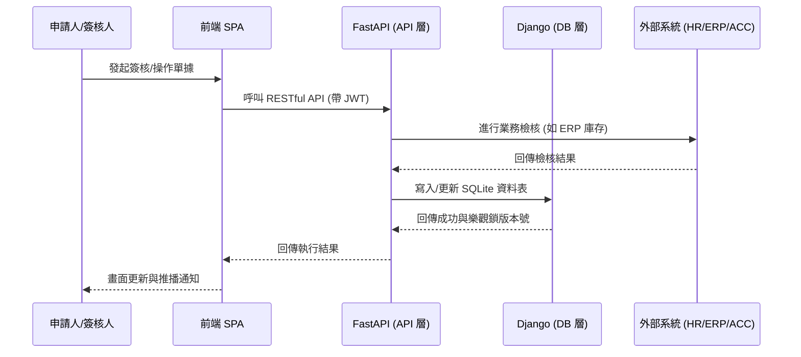

# SIT 文件：系統整合測試 (System Integration Test)

本文件定義「三廠區物流暨物料簽核系統」的系統整合測試 (SIT) 案例。由於系統採用微服務架構 (Django 作為資料與管理層、FastAPI 作為核心業務 API 層)，測試的重點在於驗證這兩層的整合、與外部系統 (ERP, HR, 會計) 的介接，以及多情境簽核流程的正確性。

---

## 1. 測試目標

1. **前後端整合與身分驗證**：確保前端透過 JWT Token 正確向 FastAPI 請求資料，且能依據登入身分套用 `isDocVisibleToUser` 資料可見度過濾。
2. **簽核引擎 (WorkflowBuilder) 正確性**：驗證系統在同廠、跨廠、高風險等不同維度下，能否動態產生正確的簽核關卡。
3. **外部系統介接 (Mock Services)**：測試與外部 HR (組織架構查詢)、ERP (庫存檢核)、會計系統 (非同步帳務同步) 的互動是否符合預期。
4. **例外處理與併發控制**：驗證自動駁回機制 (Auto-Reject)、樂觀鎖 (Optimistic Locking) 防禦多人同時簽核的狀況。

---

## 2. 測試環境與架構

* **資料層**：Django + SQLite (`signoff.db`)
* **API 層**：FastAPI + SQLAlchemy (`api_service`)
* **前端**：Vanilla JS SPA (`frontend`)
* **執行指令**：
  - `python manage.py runserver` (於 `admin_service`)
  - `uvicorn signoff_system.api:app --reload --app-dir api_service`
* **整合流程圖**：

---

## 3. 測試案例 (Test Cases)

### 3.1 身分與資料權限 (Authorization & Visibility)
| 案例編號 | 測試情境 | 測試步驟 | 預期結果 |
| :--- | :--- | :--- | :--- |
| **SIT-AUTH-01** | 一般員工僅能看到所屬廠區單據 | 使用 `EMP001` (台南員工) 登入並進入「查詢與追蹤」。 | 列表僅顯示台南廠 (TNN) 的單據，無法看到高雄廠單據。 |
| **SIT-AUTH-02** | 台北財務可見跨廠與高風險單據 | 使用 `FIN-TPE` 登入。 | 可看見所有「高風險」、「高成本」BOM 單，以及「跨廠」物料轉移單。 |
| **SIT-AUTH-03** | 建立單據權限驗證 | `FIN-TPE` 嘗試透過 API 建立 `TPE` 廠區的生產 BOM 單。 | 系統回傳 `422 Unprocessable Entity`，拒絕建立。 |

### 3.2 BOM 簽核流程 (BOM Workflow)
| 案例編號 | 測試情境 | 測試步驟 | 預期結果 |
| :--- | :--- | :--- | :--- |
| **SIT-BOM-01** | 同廠一般 BOM 簽核 | `EMP001` 建立台南一般 BOM 單並提交 ➡️ `PM-TNN` 登入簽核。 | `PM-TNN` 核准後，API 立即回傳狀態 `APPROVED`，系統透過 `BackgroundTasks` 執行會計同步。 |
| **SIT-BOM-02** | 高風險/高成本 BOM 加簽 | `EMP001` 勾選「高風險」建立 BOM ➡️ `PM-TNN` 核准 ➡️ `GM-TNN` 核准 ➡️ `FIN-TPE` 核准。 | 必須經過「生產主管 ➡️ 廠區主管 ➡️ 台北財務」三關。 |
| **SIT-BOM-03** | 簽核駁回與修改重提 | `EMP001` 建立 BOM ➡️ `PM-TNN` 選擇駁回並填寫原因 ➡️ `EMP001` 點擊「修改重提」。 | 駁回後狀態轉為 `REJECTED`；重提後狀態恢復 `DRAFT` 且版本號更新。 |

### 3.3 物料轉移流程 (Material Transfer Workflow)
| 案例編號 | 測試情境 | 測試步驟 | 預期結果 |
| :--- | :--- | :--- | :--- |
| **SIT-TRF-01** | ERP 庫存不足自動駁回 | `EMP001` 建立高雄到台南轉移單，數量輸入 500 (超過 M-GPU-NVIDIA 的 200 庫存) 並提交。 | 提交瞬間被攔截，狀態轉為 `REJECTED`，並寫入 `rejection_reason` (庫存不足)。 |
| **SIT-TRF-02** | 同廠物料轉移 | `EMP001` 建立台南廠內轉移並提交 ➡️ `WH-TNN` ➡️ `FIN-TPE` 依序核准。 | 需經過倉庫與財務兩關，最後核准後 API 立即回傳 `APPROVED`，並將會計同步排入背景。 |
| **SIT-TRF-03** | 跨廠物料轉移 | `EMP001` 建立台南到高雄轉移單並提交 ➡️ `WH-TNN` ➡️ `WH-KHH` ➡️ `FIN-TPE` 依序核准。 | 提交時觸發 ERP Reserve；最終核准時 API 立即回傳 `APPROVED` 並觸發 ERP Deduct。 |
| **SIT-TRF-04** | 撤回與預占釋放 | `EMP001` 建立轉移單並提交 ➡️ 點擊「撤回 (Cancel)」。 | 單據狀態轉為 `CANCELED`，且系統 Log 顯示成功執行 ERP Release 釋放預占庫存。 |

### 3.4 進階功能與例外處理 (Advanced Features & Exceptions)
| 案例編號 | 測試情境 | 測試步驟 | 預期結果 |
| :--- | :--- | :--- | :--- |
| **SIT-ADV-01** | 代理人簽核 (Delegation) | `PM-TNN` 設定 `EMP001` 為代理人 ➡️ 建立送往 `PM-TNN` 的單據 ➡️ `EMP001` 登入。 | `EMP001` 的待簽清單中出現該單據，且簽核 Log 註記「代理: PM-TNN」。 |
| **SIT-ADV-02** | 樂觀鎖併發控制 | 開啟兩個瀏覽器，同時對同一張正在 `APPROVING` 的單據點擊「同意」。 | 第一位成功；第二位收到 HTTP 409 (Conflict: Data has been modified) 的錯誤提示。 |
| **SIT-ADV-03** | 會計同步失敗與重試 | 觸發會計系統發生網路錯誤 (可修改 MockService 機率) ➡️ 財務點擊「重試會計同步」。 | 若達重試上限，單據狀態轉為 `SYNC_FAILED`，並允許財務手動重試。 |

---

## 4. 驗收標準 (Acceptance Criteria)

1. 所有單據在核准後，API 皆必須立即回傳 `APPROVED`（不阻塞），並透過 `BackgroundTasks` 非同步觸發 `sync_document`，最終狀態轉為 `CLOSED`。
2. SQLite 中的 `core_signoffdocument` 等資料表數據必須與前端畫面的簽核歷史一致。
3. 轉移單在提交 (`SUBMITTED`)、核准 (`APPROVED`)、撤回 (`CANCELED`) 時，必須確實呼叫 ERP 執行 Reserve / Deduct / Release 操作。
